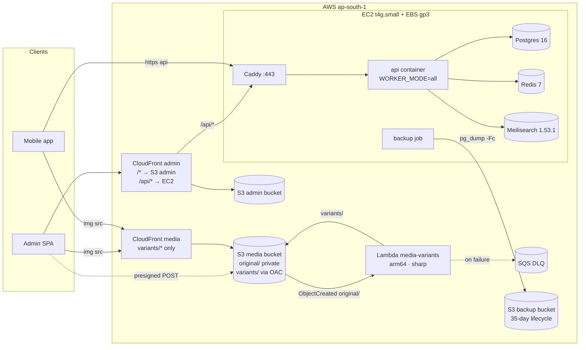
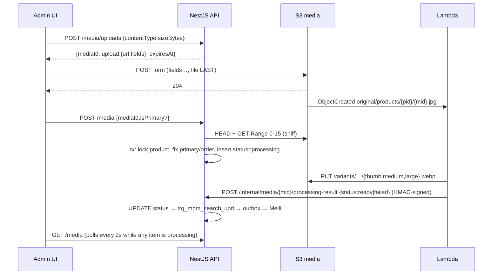

# Pre-AWS build: implementation plan

Media pipeline · WebP Lambda · backups · production box · CI/CD, all built and tested locally before any AWS resource exists.

---

## As built: where the build differs from this plan

The plan below is what was approved. Building it surfaced things the plan got wrong or did not
know. The code follows this list where the two disagree.

| Plan said                                                                     | What was built, and why                                                                                                                                                                                                                 |
| ----------------------------------------------------------------------------- | --------------------------------------------------------------------------------------------------------------------------------------------------------------------------------------------------------------------------------------- |
| `minio-init` sidecar creates buckets                                          | A Node script, `pnpm storage:init-local`. The Chainguard MinIO client image has no shell, so a sidecar cannot run a script.                                                                                                             |
| `media-lambda-local` container, MinIO `depends_on` it                         | The local Lambda server runs on the host (`pnpm --filter @golden-abode/media-lambda dev`). MinIO starts fine while the webhook target is down, so no ordering is needed.                                                                |
| Storage config fails fast at boot in production                               | It fails fast only **when a bucket is set**. With no `S3_MEDIA_BUCKET` the app boots with media disabled (uploads answer 503), because the Railway demo runs as `NODE_ENV=production` with no bucket and must keep booting.             |
| Remove `@google-cloud/storage`; use `file-type`                               | Neither was on `main` (they were only in uncommitted local changes). Image type is detected by a small magic-byte check instead of the ESM-only `file-type`.                                                                            |
| Orphan sweep script under `scripts/`                                          | Under `src/cli/` so it compiles into `dist/` and runs from the production image (`node dist/cli/sweep-orphan-media.js`); the image has no `ts-node`.                                                                                    |
| Lambda tested with Vitest 5                                                   | Vitest 3. Vitest 5 needs a newer Vite than the admin app's Vite 5.                                                                                                                                                                      |
| CI starts MinIO with `docker run ... server /data`                            | Needs `--user root`: the image's non-root user cannot create `/data` and MinIO exits with "file access denied".                                                                                                                         |
| Compose project `golden-abode` for production                                 | `golden-abode-prod`. `golden-abode` is the dev compose project's name; sharing it meant a `down -v --remove-orphans` could have deleted the dev stack and its data. Caught before it ran; the rehearsal has its own name too.           |
| Deploy files delivered from git                                               | Delivered as a bundle through S3 (`deploy-bundles/<sha>.tgz` in the backup bucket), which the box fetches over SSM. No deploy key on the box, and the config is versioned with the code.                                                |
| Demo image counts: "122 + 118, about 28 Lavish and 170 Pearl without a photo" | 122 Lavish exact; Pearl 106 exact plus 30 via base code (the cistern photos cover `C-001/IV`-style variants); **70 Lavish and 157 Pearl products have no photo**. Eight Lavish files named `.jpg` are really WebP, handled by sniffing. |
| Local Lambda processes every event at once                                    | A bounded pool (default 4), like the deployed function's reserved concurrency. Unbounded, a bulk load of 258 images took 3+ minutes and 741 callback retries; bounded it takes 19 seconds with none.                                    |
| Cost about $20–35 per month                                                   | About $22–30. The plan missed the **$3.65 per month public IPv4 charge** (corrected in 0032).                                                                                                                                           |

Not in the plan, found along the way:

- **`apps/mobile` fails `type-check` on `main`** (`VendorListingStatus` used without an import in
  `VendorListingCard.tsx`, and two axios params-serializer errors in
  `vendor-catalog-import.service.ts`). Unrelated to this work and not fixed here, but CI's
  type-check step fails because of it, which would stop the deploy pipeline's gate from ever going green.
- **Docker needs a metadata hop limit of 2** on the instance, or containers cannot use its IAM role.
- A new account's Lambda quota is often 10, which makes **reserved concurrency of 5 impossible** until it is raised.

---

## 0. Context

Decision [0032](docs/decisions/0032-aws-cost-minimized-single-box.md) (Proposed) moves Golden Abode to one EC2 box in ap-south-1. The box runs Caddy, the API/worker, Postgres, Redis and Meilisearch as containers, with media on S3 + CloudFront, all paid from AWS Free Plan credits. **The goal is to build and test everything locally first**, so that going live only means provisioning resources and setting env vars.

**What exists today (verified in code):**

| Area                   | State                                                                                                                                                                                                                                          |
| ---------------------- | ---------------------------------------------------------------------------------------------------------------------------------------------------------------------------------------------------------------------------------------------- |
| `master_product_media` | Table, model and `idx_mpm_one_primary` exist ([migration](apps/backend/database/migrations/20260825090004-create-master-product-media.js)). **Never written to.** `trg_mpm_search_*` triggers already enqueue a search re-index on any change. |
| Storage code           | None. `@google-cloud/storage`, `file-type` and `multer` are installed but unused. [0024](docs/decisions/0024-product-images-gcs.md) (GCS, server-side upload) is still "Accepted".                                                             |
| Search doc             | [`SearchDocument`](packages/types/src/search.types.ts) has no image field.                                                                                                                                                                     |
| Admin                  | [`ProductDetailModal.tsx`](apps/admin/src/components/catalog/ProductDetailModal.tsx) is 139 lines with no media. No test framework. `apiBaseUrl` defaults to relative `/api`.                                                                  |
| CI                     | One job in [`ci.yml`](.github/workflows/ci.yml). Tests are `\|\| true`. `test:e2e` points at a config that doesn't exist. No deploy step.                                                                                                      |
| Docker                 | Backend [Dockerfile](apps/backend/Dockerfile) uses node:20 while CI uses 22. Migrations run in [`docker-entrypoint.sh`](apps/backend/docker-entrypoint.sh) at every start.                                                                     |
| BullMQ                 | Already used by the existing search outbox drain. **Not touched, and not used by anything in this plan.** No new queues, no background jobs.                                                                                                   |
| Infra                  | No `infra/`, no prod compose, no Caddyfile, no backup script, no IaC.                                                                                                                                                                          |
| Demo images            | 240 JPGs under `docs/vendor-assets/{lavish-ceramics,pearl-precision}/images/**/<mfr_part_number>.jpg`                                                                                                                                          |

**Locked decisions:**

| Decision            | Choice                                                                                                                                                                                                                                    |
| ------------------- | ----------------------------------------------------------------------------------------------------------------------------------------------------------------------------------------------------------------------------------------- |
| Upload transport    | **Presigned POST** direct to S3. POST, not PUT, because only POST policies enforce `content-length-range` and an exact `Content-Type` at S3.                                                                                              |
| Uploaders           | Admin only (ADR 0009 forbids vendor images)                                                                                                                                                                                               |
| Variants            | Lambda (Node 22, arm64, sharp) triggered by S3 `ObjectCreated` on `original/`                                                                                                                                                             |
| Original visibility | **Private.** CloudFront serves `variants/*` only. EXIF/GPS never leaves S3.                                                                                                                                                               |
| Readiness           | Backend tracks `processing → ready \| failed`. **The Lambda calls the API back** with an HMAC-signed request once variants exist (or fail). No queue, no polling of S3, and the Lambda never touches the DB, so it stays outside the VPC. |
| Background work     | **None added.** Orphan cleanup is a plain script (`media:sweep`), run by hand or by the host's systemd timer.                                                                                                                             |
| Local S3            | MinIO via **Chainguard** `cgr.dev/chainguard/minio`. Docker Hub MinIO images are gone (Oct 2025); LocalStack needs an auth token (Mar 2026).                                                                                              |
| KYC bucket          | Excluded                                                                                                                                                                                                                                  |
| Admin tests         | Add Vitest + Testing Library + MSW                                                                                                                                                                                                        |
| CI                  | Tests become blocking                                                                                                                                                                                                                     |
| IaC                 | None for now (small team, single box). The runbook covers it: reviewed JSON policy docs plus exact `aws` CLI commands.                                                                                                                    |

---

## 1. Target architecture



**Upload sequence:**



**Object key scheme** (immutable keys, so the CDN never needs invalidation):

| Object   | Key                                                                                    | Access                |
| -------- | -------------------------------------------------------------------------------------- | --------------------- |
| Original | `original/products/{productId}/{mediaId}.{jpg\|png\|webp}`                             | private               |
| Variant  | `variants/products/{productId}/{mediaId}/{thumb\|medium\|large}.webp` (200/600/1200 w) | public via CloudFront |

`mediaId` is minted at presign time and becomes the row's primary key. That makes confirm idempotent, lets the Lambda's callback address the row directly, and lets the sweep script map key → row with no lookup table.

---

## 2. Phase 0: workspace & documentation (written before code)

1. **Isolation.** The current branch has unrelated uncommitted work (demo-data migration, 0031, xlsx). Don't touch it. Instead:
   - create a **git worktree** `../golden-abode-aws` on new branch `feature/aws-pre-deploy-build` from `origin/main`
   - carry over `docs/decisions/0032-*.md` and its README index row
2. **`docs/decisions/0033-product-media-s3-presigned.md`** covers:
   - the locked decisions table
   - the rejected options: server-side upload (0024), public originals, Lambda writing to the DB, LocalStack/SeaweedFS
   - consequences

   It **supersedes 0024**: update 0024's status and the index row. Note in 0032 that the KYC bucket is excluded.

3. **`docs/aws-pre-deploy-build-spec.md`** is the spec. For each of the 5 workstreams it has a Mermaid diagram, contracts (endpoints, env, keys) and failure modes, plus the testing matrix and runbook links. Its content is §3–§11 of this plan.
4. **`infra/deploy/README.md`** is the provisioning runbook (§10).

---

## 3. Phase 1: foundations

| Step | Change                                                                                                                                                                                          | Why                                                                         |
| ---- | ----------------------------------------------------------------------------------------------------------------------------------------------------------------------------------------------- | --------------------------------------------------------------------------- |
| 1.1  | Run the 4 existing specs locally and in CI and fix any failures. Then in `ci.yml` replace `pnpm run test \|\| true` with `pnpm run test` and delete the `test:e2e` line.                        | Deploys will be gated on green CI.                                          |
| 1.2  | Dockerfile `node:20-alpine` → `node:22-alpine` (both stages)                                                                                                                                    | Match CI. `meilisearch` and `file-type` are ESM and rely on `require(esm)`. |
| 1.3  | `main.ts`: `NestFactory.create(AppModule, { rawBody: true })`                                                                                                                                   | The Lambda callback's HMAC is verified over the exact raw body.             |
| 1.4  | Local S3 in the root `docker-compose.yml`, described below the table                                                                                                                            | Local stand-in for S3.                                                      |
| 1.5  | `storage` config block + fail-fast validation (§4.2)                                                                                                                                            |                                                                             |
| 1.6  | Add CI MinIO: a step `docker run -d -p 9000:9000 … cgr.dev/chainguard/minio server /data`, wait for `/minio/health/live`, and set the `S3_*` env. Tests create their own bucket in `beforeAll`. | Service containers can't pass `command`.                                    |
| 1.7  | Add an `actionlint` step and a `shellcheck infra/**/*.sh` step to CI                                                                                                                            | Workflows and scripts become linted code.                                   |

**Step 1.4 services:**

- **`minio`:** `cgr.dev/chainguard/minio`, `server /data --console-address :9001`, ports 9000/9001, a healthcheck, and these env vars:
  - `MINIO_API_CORS_ALLOW_ORIGIN=http://localhost:5173`
  - `MINIO_NOTIFY_WEBHOOK_ENABLE_LAMBDA=on`
  - `MINIO_NOTIFY_WEBHOOK_ENDPOINT_LAMBDA=http://media-lambda-local:3100/events`
- **`minio-init`:** one-shot, `cgr.dev/chainguard/minio-client`. It runs `mc mb --ignore-existing`, sets anonymous download on **`variants/` only** (mirrors prod), and runs `mc event add … --event put --prefix original/`.
- **`media-lambda-local`:** built from `apps/media-lambda/Dockerfile.local` (§6). `minio` `depends_on` it, because MinIO validates the webhook target at boot. Its env:
  - `API_CALLBACK_BASE_URL=http://host.docker.internal:3000`, since the API runs on the host via `pnpm dev`
  - the same dev `MEDIA_CALLBACK_SECRET` as the API
  - `extra_hosts: host.docker.internal:host-gateway`, so this also works on Linux CI

---

## 4. Phase 2: media backend

### 4.1 Migration `20261006090000-media-storage-columns.js` (in a transaction, house style)

```sql
ALTER TABLE master_product_media
  ALTER COLUMN id SET DEFAULT gen_random_uuid(),
  ADD COLUMN storage_key       TEXT NULL,          -- null ⇒ external-URL row
  ADD COLUMN content_type      TEXT NULL,
  ADD COLUMN size_bytes        INTEGER NULL CHECK (size_bytes > 0),
  ADD COLUMN processing_status TEXT NOT NULL DEFAULT 'ready'
      CHECK (processing_status IN ('processing','ready','failed')),
  ADD COLUMN processing_error  TEXT NULL,
  ADD COLUMN processed_at      TIMESTAMPTZ NULL;
CREATE UNIQUE INDEX idx_mpm_storage_key ON master_product_media (storage_key) WHERE storage_key IS NOT NULL;
CREATE INDEX idx_mpm_product_order ON master_product_media (master_product_id, display_order);
```

- `down()` reverses it exactly.
- Update `master-product-media.model.ts` with the new fields and a `ProcessingStatus` enum.
- **`url` semantics:** for storage-backed rows, `url` holds the `large` variant URL at insert time, only to satisfy `NOT NULL`. **All responses derive URLs from `storage_key` plus the current `MEDIA_PUBLIC_BASE_URL`**, so a CDN domain change needs no data migration. This is documented in the model comment and in 0033.

### 4.2 Config (`config/configuration.ts` → `storage`, documented in `.env.example`)

| Env                                           | Local                                      | AWS                           | Notes                                                                                |
| --------------------------------------------- | ------------------------------------------ | ----------------------------- | ------------------------------------------------------------------------------------ |
| `AWS_REGION`                                  | `ap-south-1`                               | `ap-south-1`                  |                                                                                      |
| `S3_MEDIA_BUCKET`                             | `golden-abode-media`                       | real bucket                   |                                                                                      |
| `S3_ENDPOINT`                                 | `http://localhost:9000`                    | unset                         |                                                                                      |
| `S3_FORCE_PATH_STYLE`                         | `true`                                     | unset                         |                                                                                      |
| `S3_PRESIGN_ENDPOINT`                         | unset                                      | unset                         | Browser-reachable override, used when the API runs inside Docker                     |
| `MEDIA_PUBLIC_BASE_URL`                       | `http://localhost:9000/golden-abode-media` | `https://<cloudfront-domain>` |                                                                                      |
| `MEDIA_MAX_UPLOAD_BYTES`                      | 10485760                                   | same                          |                                                                                      |
| `MEDIA_MAX_PER_PRODUCT`                       | 20                                         | same                          |                                                                                      |
| `MEDIA_PRESIGN_TTL_SECONDS`                   | 300                                        | same                          |                                                                                      |
| `MEDIA_CALLBACK_SECRET`                       | dev value                                  | SSM SecureString              | Shared with the Lambda. ≥32 chars, required in production.                           |
| `MEDIA_PROCESSING_TIMEOUT_SECONDS`            | 600                                        | same                          | After this, a `processing` item is shown as failed (computed on read, never written) |
| `AWS_ACCESS_KEY_ID` / `AWS_SECRET_ACCESS_KEY` | MinIO creds                                | **unset**                     | The instance role is picked up by the SDK default chain.                             |

`storage.config.ts` exports `loadStorageConfig()`. If `NODE_ENV=production` and any required value is missing, it throws at boot (fail fast) rather than failing on the first upload.

Dependencies: add `@aws-sdk/client-s3` and `@aws-sdk/s3-presigned-post`; remove `@google-cloud/storage`.

### 4.3 Module layout: `apps/backend/src/modules/catalog/media/`

| File                                | Responsibility                                                                                                                                                                  |
| ----------------------------------- | ------------------------------------------------------------------------------------------------------------------------------------------------------------------------------- |
| `object-storage.ts`                 | Interface: `presignPost`, `head`, `readRange`, `put`, `copyInPlace`, `deleteMany`, `list(prefix, continuationToken)`. Plus the `OBJECT_STORAGE` injection token.                |
| `s3-object-storage.service.ts`      | AWS SDK v3 implementation, the only file that imports the SDK. It uses two clients: the internal endpoint for operations, and `S3_PRESIGN_ENDPOINT` for presigning.             |
| `media-keys.ts`                     | Pure functions: `originalKey`, `variantKeys`, `failureMarkerKey`, `parseOriginalKey` (strict UUID regex), `variantUrls(baseUrl, key)`                                           |
| `image-sniff.ts`                    | Pure magic-byte check for JPEG (`FF D8 FF`), PNG (8-byte signature) and WebP (`RIFF….WEBP`). It replaces the ESM-only `file-type`, which avoids interop risk for three formats. |
| `media.service.ts`                  | Business rules (§4.4)                                                                                                                                                           |
| `admin-media.controller.ts`         | Endpoints (§4.5), with the admin guard stack copied from `admin-catalog.controller.ts:19-23`                                                                                    |
| `internal-media.controller.ts`      | The Lambda callback endpoint (§4.6). No JWT; guarded by `MediaCallbackSignatureGuard`. Hidden from Swagger.                                                                     |
| `media-callback-signature.guard.ts` | Verifies the HMAC over timestamp + raw body                                                                                                                                     |
| `dto/*.ts`                          | class-validator DTOs following the house style. `forbidNonWhitelisted` is already global.                                                                                       |

Register these in `catalog.module.ts`. The orphan sweep is a script, `apps/backend/scripts/sweep-orphan-media.ts` (§4.7), not part of the running app.

### 4.4 Service rules

**`createUpload(productId, {contentType, sizeBytes})`:**

1. The product must exist (404).
2. `contentType` must be jpeg/png/webp. HEIC is rejected with a clear message, because sharp's prebuilt binary lacks HEVC.
3. `sizeBytes` must be ≤ the max.
4. The product's media count (including `processing`) must be < `MEDIA_MAX_PER_PRODUCT` (409).
5. Mint `mediaId`, build the key, and `presignPost` with these conditions:
   - `{bucket}`, `{key}` exact
   - `Content-Type` exact
   - `content-length-range [1, max]`
   - `Cache-Control: public, max-age=31536000, immutable`
   - expiry = TTL
6. Nothing is written to the DB; the sweep script owns abandoned uploads.

**`confirm(productId, {mediaId, isPrimary?, isRepresentative?})`:**

1. Rebuild the key from `productId` and `mediaId`, so it can never be supplied by the client.
2. **Idempotent:** if a row with `id = mediaId` already exists for this product, return it (200).
3. `head(key)`. A 404 means the upload is missing or expired (400). Then check `ContentLength ≤ max` and that `ContentType` is allowed.
4. `readRange(key, 0-15)` → `image-sniff`. On a mismatch, `deleteMany([key])` and return 400 "file is not a valid JPEG/PNG/WebP".
5. **Transaction:**
   - `SELECT … FROM master_product WHERE id=$1 FOR UPDATE` serializes concurrent confirms per product
   - re-check the count cap
   - `displayOrder = max+1`
   - if `isPrimary`, or no primary exists yet, set the other rows to `is_primary=false` first and then insert as primary. This respects `idx_mpm_one_primary`.
   - insert with `type='image'`, `processing_status='processing'`, and `url = large variant URL`
6. Nothing else happens after commit. The Lambda's callback moves the row to `ready` or `failed`.
7. **Race:** the Lambda can finish before confirm commits (it starts the moment S3 accepts the file). The callback then finds no row and returns 404. The Lambda treats that as "retry later" (§6), and S3's async retries arrive after confirm. If confirm never happens, the object is an orphan, and the sweep removes it.

**`update(mediaId, {isPrimary?, isRepresentative?})`:** runs under the same product lock. Setting `isPrimary=false` on the only primary is a 400; promote another image instead.

**`reorder(productId, {mediaIds})`:** the list must be exactly the product's media set (400 otherwise). A transaction rewrites `display_order` to 0..n-1.

**`remove(mediaId)`:**

1. Transaction: delete the row. If it was primary, promote the lowest `display_order` remaining.
2. After commit, best-effort `deleteMany`(original + 3 variants). On failure, log a warning and leave the rest to the sweep script.
3. The DB is the source of truth throughout.

**`reprocess(mediaId)`:**

1. Allowed only when the effective status is `failed`, including a stale `processing` past the timeout (409 otherwise).
2. Set `processing`, reset `processed_at`, clear the error.
3. `copyInPlace(original)`: a CopyObject onto itself with `MetadataDirective=REPLACE` and `x-amz-meta-reprocess-at`. This emits a fresh `ObjectCreated`, so the Lambda re-runs and calls back.

All DB errors go through the existing `translateWriteError` pattern (`admin-catalog.service.ts:640-665`).

### 4.5 Endpoints

All are under `/api/admin/catalog/products/:productId/media`, with `JwtAuthGuard + RolesGuard + @Roles(ADMIN)` and Swagger tags.

| Method & path              | Body                                       | Success                                                    | Errors                                   |
| -------------------------- | ------------------------------------------ | ---------------------------------------------------------- | ---------------------------------------- |
| `POST /uploads`            | `{contentType, sizeBytes}`                 | 201 `{mediaId, upload:{url, fields}, expiresAt, maxBytes}` | 400 type/size · 404 product · 409 cap    |
| `POST /`                   | `{mediaId, isPrimary?, isRepresentative?}` | 201 item (200 on idempotent replay)                        | 400 missing/invalid file · 404 · 409 cap |
| `GET /`                    | —                                          | 200 `item[]` sorted by `display_order`                     | 404                                      |
| `PATCH /:mediaId`          | `{isPrimary?, isRepresentative?}`          | 200 item                                                   | 400 · 404                                |
| `PUT /order`               | `{mediaIds: uuid[]}`                       | 200 `item[]`                                               | 400 set mismatch                         |
| `DELETE /:mediaId`         | —                                          | 204                                                        | 404                                      |
| `POST /:mediaId/reprocess` | —                                          | 202 item                                                   | 409 not failed                           |

**Item shape:** `{id, type, status, error?, isPrimary, isRepresentative, displayOrder, contentType, sizeBytes, variants: {thumb, medium, large} | null, createdAt}`.

- `variants` is non-null only when `status='ready'`; for external-URL rows all three equal `url`.
- `status` is the **effective** status: a stored `processing` whose `updated_at` is older than `MEDIA_PROCESSING_TIMEOUT_SECONDS` is reported as `failed` with `error='processing timed out'`. This is computed on read, with no job and no write.

**Internal (not admin):** `POST /api/internal/media/:mediaId/processing-result`, see §4.6.

`getProduct` (`admin-catalog.service.ts:258`) gains `media: item[]`, which the controller's Swagger summary already promises.

### 4.6 Lambda callback: `POST /api/internal/media/:mediaId/processing-result`

**Request:**

- Body: `{ status: 'ready' | 'failed', reason?: string (≤500 chars), variantsWritten?: string[] }`
- Headers: `X-Media-Timestamp: <unix seconds>`, `X-Media-Signature: sha256=<hex HMAC-SHA256(MEDIA_CALLBACK_SECRET, timestamp + "." + rawBody)>`

**`MediaCallbackSignatureGuard`** returns 401 when:

- either header is missing
- the clock skew is more than 300s (replay window)
- the signature doesn't match, compared with `crypto.timingSafeEqual` over equal-length buffers

**Handler:**

1. Look up the row by `id`. If there is none, return **404**. The Lambda retries on 404, which covers the race where confirm hasn't committed yet.
2. If the row is not `processing`, return **200 no-op**. Duplicate deliveries and late retries are harmless.
3. `ready`: set `status=ready`, `processed_at=now()`, `processing_error=null`. That fires `trg_mpm_search_upd` → the product is re-indexed.
4. `failed`: set `status=failed` and `processing_error=reason`.

**Route rules:** the route is excluded from the JWT guards and hidden from Swagger. It is reachable only through Caddy over HTTPS. Its only inputs are an id and a status, so a leaked secret could at worst flip a status, never read data.

### 4.7 Orphan sweep script: `apps/backend/scripts/sweep-orphan-media.ts` (`pnpm --filter backend media:sweep [--apply]`)

1. List `original/products/` and `variants/products/` page by page, and parse each key with the strict regex. Anything unparseable is **never deleted**; it is logged instead.
2. Keep only objects with `LastModified < now − 24h` (protects in-flight uploads).
3. Look up existing ids with `SELECT id FROM master_product_media WHERE id = ANY($1)`, batched 1000 at a time.
4. Unreferenced means delete. There is a **circuit breaker**: if more than 500 deletions are pending in one run, delete nothing and exit 1.
5. Dry-run is the default and logs the counts and keys. `--apply` deletes. `--min-age-hours N` (default 24) exists for tests and local verification.

On the box it runs weekly from a systemd timer (§9) via `docker compose run --rm api node dist/scripts/sweep-orphan-media.js --apply`, after the first two weeks of dry-run output have been reviewed. This also covers objects left behind by product cascade-deletes and by failed best-effort deletes.

### 4.8 Demo image loader: `apps/backend/scripts/load-demo-media.ts` (`pnpm --filter backend media:load-demo`)

1. Walk `docs/vendor-assets/*/images/**/*.jpg` and match the filename stem to `master_product.mfr_part_number`, scoped by brand.
2. **Pearl fallback:** if there is no exact match, look up products whose part number starts with the base code (`C-001` → all colour variants), and attach the same image to each. Each product gets its own `mediaId` and its own copy of the object, so the immutable key scheme holds.
3. **Idempotent:** skip a product that already has media with `type='image'`.
4. Per image: `put` the original, then run the same confirm path through `MediaService` (reusing the sniff and transaction), with the first image marked primary. The `put` triggers the Lambda exactly like a browser upload does: on AWS through the S3 trigger, locally through the MinIO webhook → `media-lambda-local`.
5. At the end, wait up to 2 minutes for every new row to leave `processing` and print the ready/failed totals.
6. Flags: `--dry-run` (default prints the plan) and `--apply`.
7. Report: matched/attached counts per brand, plus a **list of products left without an image**.

### 4.9 Backend tests (Jest, real Postgres + MinIO; house style forbids mocks)

- **Unit:** `media-keys.spec.ts` (round-trip, rejects traversal/foreign UUIDs), `image-sniff.spec.ts` (3 valid formats, renamed txt, truncated file), `storage.config.spec.ts` (fail-fast in production).
- **Integration, `media.service.spec.ts`:**
  - presign → real multipart POST to MinIO → confirm creates the row
  - replaying confirm is idempotent
  - an 11 MB file is rejected **by MinIO's policy**
  - a renamed `.txt` gets a 400 and its object is deleted
  - the 21st image gets a 409
  - two concurrent confirms with `isPrimary` leave exactly one primary
  - delete promotes the next primary
  - `reorder` with a set mismatch gets a 400
  - callback `ready` on a `processing` row → `ready`, which inserts a `search_outbox` row; callback `failed` stores the reason; a duplicate callback is a no-op; a callback for an unknown id → 404
  - a `processing` row older than the timeout reads back as `failed` and can be reprocessed
  - the sweep script honours dry-run, the 24h cutoff, the circuit breaker and unparseable keys
- **Controller, `admin-media.controller.spec.ts`:** Nest app + supertest. Covers 401 without a token, 403 with a vendor token, 400 on unknown body fields, and the response envelope `{success, data}`.
- **Callback, `internal-media.controller.spec.ts`:** a valid signature → 200; a bad signature, missing headers, or a timestamp more than 300s old → 401; a body altered after signing → 401; an admin JWT alone (no signature) → 401.

---

## 5. Phase 3: search integration

1. `packages/types/src/search.types.ts`:
   - `SearchDocument.primaryImage: {thumb, medium, large} | null`
   - `SearchDocumentRecord.primary_image`
   - both mappers
   - readers treat `undefined` (old documents) as `null`
2. New `apps/backend/src/modules/search/primary-image.sql.ts`: one shared `LEFT JOIN LATERAL` snippet. It picks the image with `type='image' AND processing_status='ready'`, ordered by `is_primary DESC, display_order, created_at`, `LIMIT 1`, and returns `storage_key, url`.
3. Use the snippet in `search-document.builder.ts` and in both queries of `fallback/postgres-search.service.ts`, mapped through `variantUrls()` so the two engines agree. `meili.indexes.ts` needs no change: the field is neither searchable nor filterable, and displayed by default.
4. **Runbook step:** after deploy, request a full rebuild through the existing rebuild marker.
5. **Tests:** extend the builder spec. A ready image appears in the document, a processing one does not, and an external-URL row maps to the same URL for all three sizes.

---

## 6. Phase 4: WebP variants Lambda: `apps/media-lambda/` (`@golden-abode/media-lambda`)

```
apps/media-lambda/
  src/variants.ts        pure: generateVariants(buf) → [{name,width,body}]
  src/handler.ts         S3Event → read → generate → write → callback
  src/s3.ts              client (endpoint override for MinIO)
  src/callback.ts        HMAC-signed POST to the API (node fetch, 5s timeout)
  src/log.ts             one JSON line per record
  src/local/server.ts    HTTP :3100 POST /events (MinIO webhook body = S3 Records) → handler
  scripts/package.mjs    esbuild bundle + linux-arm64 sharp → dist/function.zip
  Dockerfile.local       node:22-slim, runs local/server.ts (sharp linux binary inside the container)
  test/fixtures/*        jpeg, png, webp, EXIF-rotated, 1×1, 9000×9000, corrupt, renamed-txt
```

**`generateVariants`:**

1. `sharp(buf, { limitInputPixels: 40_000_000, failOn: 'error' })`, then `.rotate()` to honour EXIF.
2. Strip metadata (sharp's default).
3. For `thumb 200`, `medium 600` and `large 1200`: `.clone().resize({ width, withoutEnlargement: true }).webp({ quality: 80, effort: 4 })`.

**`handler` (per record):**

1. Decode the key with `decodeURIComponent(key.replace(/\+/g,' '))`.
2. **Ignore** anything that doesn't parse as `original/products/{uuid}/{uuid}.{ext}`. This guards against recursion, and the S3 trigger also filters on the `original/` prefix.
3. Skip if `record.s3.object.size` exceeds the max.
4. `GetObject`, then `generateVariants`, then `PutObject` ×3 with `ContentType: image/webp` and `CacheControl: public, max-age=31536000, immutable`.
5. Callback `{status:'ready'}` to `${API_CALLBACK_BASE_URL}/api/internal/media/{mediaId}/processing-result`.

**Error classes:**

- **Non-retryable image problem** (decode failure, pixel limit, unsupported format): callback `{status:'failed', reason}` and **return normally**. The admin sees "Failed – Retry" within seconds.
- **Retryable** (S3 5xx/throttling, callback network error/5xx/**404**): throw. A 404 means confirm hasn't committed yet. S3 async invocation retries twice (about 1 min, then about 2 min later), then sends the event to the **SQS DLQ**. A row that never hears back shows as failed after the processing timeout, and the admin can retry it.
- **Callback 401:** throw. This is a misconfigured secret, and it shows up in the DLQ and the logs.
- **Idempotent:** a re-run overwrites identical keys, and a repeat callback is a no-op.

**Lambda config (set in the runbook):**

| Setting                | Value                                                                                                                                |
| ---------------------- | ------------------------------------------------------------------------------------------------------------------------------------ |
| Runtime                | `nodejs22.x`                                                                                                                         |
| Architecture           | `arm64`                                                                                                                              |
| Memory / timeout       | 1024 MB / 30 s                                                                                                                       |
| Reserved concurrency   | 5, a cost and blast-radius cap                                                                                                       |
| On-failure destination | SQS DLQ                                                                                                                              |
| Env                    | `VARIANTS_MAX_INPUT_PIXELS`, `MAX_SOURCE_BYTES`, `API_CALLBACK_BASE_URL`, `MEDIA_CALLBACK_SECRET` (from SSM at deploy, never in git) |
| Logs                   | 14-day retention                                                                                                                     |

**Packaging:** `sharp` is pinned to an exact version. The esbuild bundle is CJS for node22 with sharp external. Then `npm install --prefix dist/pkg --os=linux --cpu=arm64 --libc=glibc sharp@<pinned>`, and the result is zipped. A CI assertion checks the zip contains `@img/sharp-linux-arm64`.

**Tests:**

- **Unit (Vitest or Jest on the host's own sharp binary):**
  - output widths for each fixture
  - EXIF orientation is applied
  - no enlargement of a 1×1 image
  - pixel-limit and corrupt files → `failed` callback, no throw
  - a `variants/` key is ignored
  - callback signing matches the backend guard's algorithm, via a shared test vector in both test suites
  - a callback 404 or 5xx → throws (so S3 retries)
- **Integration:** run the handler against MinIO with a synthetic event and a stub HTTP server recording the callback. `pnpm --filter media-lambda invoke-local <file>` does the same thing manually against the real local API.

---

## 7. Phase 5: admin media UI

**Files (`apps/admin/src`):**

| File                                             | Purpose                                                                                                                                                                                                                                                                                                                                  |
| ------------------------------------------------ | ---------------------------------------------------------------------------------------------------------------------------------------------------------------------------------------------------------------------------------------------------------------------------------------------------------------------------------------- |
| `services/mediaService.ts`                       | `requestUpload`, `confirmUpload`, `listMedia`, `updateMedia`, `reorderMedia`, `deleteMedia`, `reprocessMedia` (via `apiClient`), plus **`uploadToS3(upload, file, onProgress)`**. That one uses `XMLHttpRequest` for progress events. Policy fields are appended first and **`file` last** (S3 requirement), and there's no auth header. |
| `queries/useMediaQueries.ts`                     | `useProductMediaQuery(productId)` with `refetchInterval: 2000` **only while** an item is `processing`. Mutations invalidate the media query and the product query.                                                                                                                                                                       |
| `components/catalog/media/ProductMediaPanel.tsx` | Section embedded in `ProductDetailModal`                                                                                                                                                                                                                                                                                                 |
| `components/catalog/media/MediaUploader.tsx`     | Drag-drop + file picker, multiple files. Validates type and size client-side before calling the API. **Max 3 concurrent uploads.** Shows per-file progress and errors.                                                                                                                                                                   |
| `components/catalog/media/MediaGrid.tsx`         | Thumbnails (the `thumb` variant, or a "Processing…" / "Failed – Retry" placeholder). Badges for Primary and Representative. Actions: set primary, toggle representative, move ←/→ (which calls `PUT /order`), delete with confirmation.                                                                                                  |
| `services/api/apiEndpoints.ts`                   | New endpoint constants                                                                                                                                                                                                                                                                                                                   |
| `styles/catalog.module.css`                      | Grid and badge styles                                                                                                                                                                                                                                                                                                                    |

**Tests:** add `vitest`, `@testing-library/react`, `@testing-library/user-event`, `jsdom` and `msw`, plus the `test` script, so turbo `test` picks it up.

- `uploadToS3`: field order puts `file` last; a progress callback fires.
- Uploader rejects HEIC and files over 10 MB without calling the API.
- Panel renders the processing, ready and failed states; Retry calls reprocess.
- Polling stops once nothing is processing.
- Set-primary and reorder send the correct payloads.

---

## 8. Phase 6: backup & restore: `infra/deploy/backup/`

| File                                     | Content                                                                                                                                                                                                                                                                                                                   |
| ---------------------------------------- | ------------------------------------------------------------------------------------------------------------------------------------------------------------------------------------------------------------------------------------------------------------------------------------------------------------------------- |
| `Dockerfile`                             | `FROM postgres:16-alpine` (pg_dump major version = server's), plus `aws-cli` and the scripts                                                                                                                                                                                                                              |
| `pg-backup.sh`                           | `set -euo pipefail`, trap cleanup. Steps listed below.                                                                                                                                                                                                                                                                    |
| `pg-restore.sh`                          | `--latest \| --key K`, `--target-db NAME`. Refuses if the target equals `$PGDATABASE` unless `--force`. Steps: download → sha256 check → `createdb` → `pg_restore --no-owner --no-acl` → **sanity queries** (row counts for `master_product`, `vendor_listing`, `vendors`, `users`) printed side by side with the source. |
| `golden-abode-backup.service` / `.timer` | systemd on the host: `OnCalendar=*-*-* 02:30 Asia/Kolkata`, `Persistent=true`, runs `docker compose --profile backup run --rm backup`                                                                                                                                                                                     |

**`pg-backup.sh` steps:**

1. `pg_dump -Fc -Z6 -f $tmp`
2. **Verify** with `pg_restore --list $tmp`
3. Compute sha256
4. `aws s3 cp` to `s3://$BACKUP_BUCKET/postgres/YYYY/MM/DD/golden_abode-<UTC ts>.dump` with `--metadata sha256=…`
5. Write `postgres/last-success.json {ts, key, bytes, sha256, durationSec}`
6. If `BACKUP_METRIC_ENABLED`: `aws cloudwatch put-metric-data GoldenAbode/Backup Success=1`

`BACKUP_S3_ENDPOINT` can be set for MinIO. A non-zero exit means failure.

- **Retention:** an S3 lifecycle rule deletes objects after 35 days.
- **Alerting:** a CloudWatch alarm fires on `Success` with **missing data treated as breaching**, over a 26h window, and notifies by email through SNS. This uses the free tier's 10 alarms.
- **Not backed up:** Meilisearch (rebuildable from Postgres via the rebuild marker) and Redis (only transient BullMQ jobs; AOF covers restarts).
- **Restore drill:** monthly, documented in the runbook.
- **Pre-deploy snapshot:** `deploy.sh` runs the same backup before every deploy, because migrations run on container start.

---

## 9. Phase 7: production box config: `infra/deploy/`

**`docker-compose.prod.yml`.** Every service has `restart: unless-stopped` and json-file logging capped at `max-size 10m, max-file 3` to protect the disk. Data is bind-mounted to `/var/lib/golden-abode/*` on EBS.

| Service     | Image                          | Memory limit | Key settings                                                                                                                                                   |
| ----------- | ------------------------------ | ------------ | -------------------------------------------------------------------------------------------------------------------------------------------------------------- |
| caddy       | `caddy:2.8-alpine`             | 64m          | The **only** service publishing 80/443. Volumes `caddy_data` and `caddy_config`.                                                                               |
| api         | `${API_IMAGE}` (ECR:sha)       | 640m         | `env_file: .env`, `NODE_OPTIONS=--max-old-space-size=448`, healthcheck `wget -qO- localhost:3000/health`, `depends_on` all three stores with `service_healthy` |
| postgres    | `postgres:16-alpine`           | 448m         | `-c shared_buffers=128MB -c max_connections=40 -c effective_cache_size=320MB -c work_mem=4MB`                                                                  |
| redis       | `redis:7-alpine`               | 96m          | `--appendonly yes --maxmemory 64mb --maxmemory-policy noeviction`. The existing search drain's BullMQ **requires** noeviction.                                 |
| meilisearch | `getmeili/meilisearch:v1.53.1` | 448m         | `MEILI_ENV=production`, `MEILI_MAX_INDEXING_MEMORY=256MiB`, `MEILI_NO_ANALYTICS=true`. **No ports.** Data on local EBS (0021).                                 |
| backup      | built from `backup/`           | 256m         | `profiles: [backup]`                                                                                                                                           |

The limits total about 1.95 GB, so the runbook adds a **2 GB swap file** on EBS as a safety net. The spec states the sizing rule: upgrade to t4g.medium if swap use stays above 0.

**`Caddyfile`:**

```
{ email {$ACME_EMAIL} }
{$API_DOMAIN} {
  encode zstd gzip
  request_body { max_size 25MB }        # xlsx imports still go through the API
  header -Server
  reverse_proxy api:3000 { health_uri /health  health_interval 10s }
  log { output stdout  format json }
}
```

**Scripts:**

- **`render-env.sh`:** runs `aws ssm get-parameters-by-path --path /golden-abode/prod/ --with-decryption` and writes `/opt/golden-abode/.env` with `chmod 600`. Secrets never live in git or in CI.
- **`deploy.sh <tag>`:**
  1. `flock` against concurrent deploys
  2. `render-env.sh`
  3. ECR login with the instance role
  4. `docker compose pull api`
  5. **pre-deploy backup**
  6. record the previous tag from `.current-tag`
  7. `up -d --no-deps api`
  8. wait up to 180s for the container to report healthy **and** for `curl https://$API_DOMAIN/health` to succeed
  9. on failure: restore the previous tag, `up -d`, exit 1
  10. on success: write `.current-tag` and keep the last 3 images (`docker image prune` by tag list)
- **`bootstrap-host.sh`** (one-time):
  - install Docker + compose plugin
  - create the swap file and data directories
  - install the systemd timers: nightly backup and weekly `media:sweep` (dry-run until switched on in the runbook)
  - enable unattended security updates (`dnf-automatic` on Amazon Linux 2023)

**Documented constraints:**

- **Deploys have about 10–20s of downtime** (one container gets replaced). Zero-downtime deploys are out of scope for now.
- **Migrations must be backward-compatible (expand/contract)**, because a rollback can't undo an applied migration. The pre-deploy backup is the escape hatch.

**Local rehearsal:** `infra/deploy/docker-compose.rehearsal.override.yml`:

- uses a locally built image
- sets `API_DOMAIN=localhost`, so Caddy uses its internal CA
- adds MinIO as S3
- points `BACKUP_S3_ENDPOINT` at MinIO

---

## 10. Phase 8: CI/CD & provisioning artifacts

**`ci.yml`** (after Phase 1):

- format → lint → type-check → build → migrate → **test (blocking**: backend + media-lambda + admin)
- actionlint, shellcheck
- `docker build -f apps/backend/Dockerfile .` (no push), which catches Dockerfile breakage on every PR

**`.github/workflows/deploy-aws.yml`:**

**Triggers:** `workflow_run: [CI/CD Pipeline] completed on main` and `workflow_dispatch`.

**Gating:**

- `vars.AWS_DEPLOY_ENABLED == 'true'`, **and** either a dispatch or `workflow_run.conclusion == 'success'`
- `concurrency: deploy-prod` with `cancel-in-progress: false`
- `permissions: id-token: write, contents: read`
- a GitHub `environment: production`, which can optionally require reviewer approval
- checkout of `workflow_run.head_sha`, so it deploys exactly what CI tested

**Auth:** `aws-actions/configure-aws-credentials@v4` with `role-to-assume: vars.AWS_DEPLOY_ROLE_ARN` and `aws-region: ap-south-1`. No stored keys.

**Jobs:**

| Job              | Needs                        | Steps                                                                                                                                                                                                                                                                               |
| ---------------- | ---------------------------- | ----------------------------------------------------------------------------------------------------------------------------------------------------------------------------------------------------------------------------------------------------------------------------------- |
| `build-backend`  | —                            | buildx `linux/arm64` (native `ubuntu-24.04-arm` runner if available to the repo, otherwise QEMU), `cache-from/to: type=gha`, push `ECR/golden-abode-backend:${sha}`                                                                                                                 |
| `build-lambda`   | —                            | `package.mjs`, assert the arm64 sharp is present, upload the zip artifact                                                                                                                                                                                                           |
| `build-admin`    | —                            | `pnpm --filter @golden-abode/admin build` (relative `/api`), upload dist                                                                                                                                                                                                            |
| `deploy-backend` | build-backend                | `aws ssm send-command` (AWS-RunShellScript, target tag `Role=golden-abode-app`) running `/opt/golden-abode/deploy.sh ${sha}`. Poll `get-command-invocation` until it finishes (900s timeout). Fail on non-zero and print stdout/stderr.                                             |
| `deploy-lambda`  | deploy-backend, build-lambda | `update-function-code`, wait for `function-updated`, `publish-version`, point the `live` alias at it (the trigger uses the alias, so rollback = repoint the alias). Function env (`API_CALLBACK_BASE_URL`, `MEDIA_CALLBACK_SECRET`) is set once in the runbook from SSM, not by CI. |
| `deploy-admin`   | deploy-backend, build-admin  | `s3 sync` hashed assets with `immutable` cache, `index.html` with `no-cache`, `--delete`, CloudFront invalidation of `/index.html`                                                                                                                                                  |
| `smoke`          | all                          | `curl /health`, admin `/` returns 200, and the CloudFront media domain returns 403 for an `original/` path (proves originals are private)                                                                                                                                           |

**`infra/aws/`** holds the reviewed provisioning artifacts. They are not Terraform; the runbook applies them with exact CLI commands.

| File                            | Content                                                                                                                                                                                                                                                                                  |
| ------------------------------- | ---------------------------------------------------------------------------------------------------------------------------------------------------------------------------------------------------------------------------------------------------------------------------------------- |
| `iam/github-deploy-trust.json`  | OIDC trust, `sub = repo:<org>/<repo>:environment:production`                                                                                                                                                                                                                             |
| `iam/github-deploy-policy.json` | ECR push to one repo; `ssm:SendCommand` limited to the tagged instance and `AWS-RunShellScript`; `lambda:UpdateFunctionCode/PublishVersion/UpdateAlias` on one function; `s3:PutObject/DeleteObject/ListBucket` on the admin bucket; `cloudfront:CreateInvalidation` on one distribution |
| `iam/ec2-instance-policy.json`  | ECR pull; SSM managed core; `ssm:GetParametersByPath` on `/golden-abode/prod/*`; media bucket get/put/delete/list; backup bucket put/list/get; `cloudwatch:PutMetricData` (namespace-conditioned)                                                                                        |
| `iam/lambda-policy.json`        | `s3:GetObject` on `original/*`, `s3:PutObject` on `variants/*`, SQS send to the DLQ, logs                                                                                                                                                                                                |
| `s3/media-bucket-policy.json`   | CloudFront OAC read on **`variants/*` only**                                                                                                                                                                                                                                             |
| `s3/media-cors.json`            | `POST` from the admin origin(s) only                                                                                                                                                                                                                                                     |
| `s3/*-lifecycle.json`           | backups expire after 35d; abort incomplete multipart uploads after 1d                                                                                                                                                                                                                    |
| `cloudfront/*.md`               | behaviours, cache policies, and the `/api/*` → API origin behaviour (CachingDisabled, AllViewerExceptHostHeader)                                                                                                                                                                         |

**`infra/deploy/README.md` runbook**, in order:

1. Free Plan signup + budget (earns $20)
2. Region + key pair-less EC2 access via SSM Session Manager (no SSH port open)
3. VPC default + SG (80/443 from the internet only)
4. EBS gp3 30GB, encrypted
5. Instance role → `bootstrap-host.sh`
6. ECR repo with a lifecycle rule (keep 10)
7. Buckets: Block Public Access ON for all three, SSE-S3, versioning on backups
8. CloudFront ×2 with OAC
9. Lambda + `live` alias + S3 trigger (prefix `original/`, events `s3:ObjectCreated:*`) + DLQ
10. SSM parameters
11. OIDC provider + deploy role
12. GitHub vars `AWS_DEPLOY_ENABLED`, `AWS_DEPLOY_ROLE_ARN`, `ECR_REPO`, `MEDIA/ADMIN` ids
13. DNS
14. First deploy
15. `media:load-demo --apply`
16. Search rebuild
17. Backup + restore drill
18. Review two weeks of `media:sweep` dry-run output, then switch the timer to `--apply`

---

## 11. Cross-cutting

**Security checklist:**

- presign conditions lock bucket, key, type and size
- the key is server-derived on confirm
- magic-byte sniff on confirm
- `limitInputPixels` against decompression bombs
- EXIF stripped and originals private
- all buckets have Block Public Access, with OAC-only reads
- IAM least privilege per principal, with no long-lived AWS keys anywhere (OIDC, instance role, Lambda role)
- secrets in SSM SecureString
- Meilisearch and Postgres never published
- no SSH (Session Manager)
- Caddy hides the `Server` header
- admin-only guards plus a vendor-token 403 test

**Failure modes:**

| Failure                                         | Behaviour                                                                                                             |
| ----------------------------------------------- | --------------------------------------------------------------------------------------------------------------------- |
| Upload abandoned after presign                  | No DB row; the weekly sweep script deletes it (24h minimum age)                                                       |
| Corrupt or renamed file                         | Confirm returns 400 and deletes the object; if it slipped past, the Lambda calls back `failed` → Retry in the UI      |
| Lambda finishes before confirm commits          | Callback gets 404 → Lambda throws → S3 retries after confirm has committed                                            |
| Lambda down, throttled, or callback unreachable | S3 retries ×2, then the DLQ. The row shows as failed after the 10-min timeout (computed on read). Admin clicks Retry. |
| Variant delete fails                            | Row already gone; the sweep script cleans up                                                                          |
| Two admins set primary at once                  | `FOR UPDATE` serializes them; the partial unique index is the backstop                                                |
| Box dies                                        | Restore from the latest S3 dump (RPO ≤ 24h, plus the pre-deploy snapshots), rebuild Meilisearch, media unaffected     |
| Bad deploy                                      | `deploy.sh` restores the previous tag automatically; the pre-deploy backup exists if a migration is at fault          |
| Backup silently stops                           | CloudWatch missing-data alarm sends an email within 26h                                                               |
| CDN domain changes                              | URLs are derived from `storage_key` at read time; one search rebuild                                                  |
| Memory pressure                                 | Per-container limits plus swap; the sizing rule says upgrade to t4g.medium                                            |

**Testing matrix:**

| Layer                                                                 | Tool                         | Runs in                  |
| --------------------------------------------------------------------- | ---------------------------- | ------------------------ |
| Pure functions (keys, sniff, config, variants)                        | Jest / Vitest                | CI                       |
| Media service + sweep script                                          | Jest, real Postgres + MinIO  | CI                       |
| Controller auth/validation/envelope + callback HMAC                   | Jest + supertest             | CI                       |
| Lambda handler                                                        | Jest, fixtures + MinIO       | CI                       |
| Admin UI                                                              | Vitest + RTL + MSW           | CI                       |
| Shell scripts / workflows                                             | shellcheck / actionlint      | CI                       |
| Backup → restore round-trip                                           | rehearsal compose + MinIO    | local (manual, scripted) |
| Full flow: admin upload → MinIO event → local Lambda → ready → search | browser                      | local (manual checklist) |
| Real AWS smoke                                                        | `smoke` job + runbook drills | after provisioning       |

---

## 12. Build order & commits (one PR, one commit per row; you + me ≈ 5–6 working days)

| #   | Commit                                                                                         | Est.  |
| --- | ---------------------------------------------------------------------------------------------- | ----- |
| 1   | docs: 0033 + spec + 0024 superseded + index                                                    | 0.5d  |
| 2   | ci: blocking tests, fix failing specs, actionlint/shellcheck; Dockerfile node 22               | 0.5d  |
| 3   | infra(dev): MinIO + init + local Lambda runner wiring; `rawBody` in main.ts                    | 0.25d |
| 4   | feat(media): migration, config, storage, keys, sniff + unit tests                              | 0.5d  |
| 5   | feat(media): service, admin controller, signed callback endpoint, sweep script + tests         | 1d    |
| 6   | feat(media-lambda): package, handler, local runner, packaging + tests                          | 0.75d |
| 7   | feat(search): primaryImage in doc, builder, fallback + tests                                   | 0.25d |
| 8   | feat(admin): Vitest setup + media panel + tests                                                | 1d    |
| 9   | feat(media): demo image loader                                                                 | 0.25d |
| 10  | infra(deploy): prod compose, Caddyfile, deploy/render-env/bootstrap, backup + restore, systemd | 0.75d |
| 11  | ci: deploy-aws.yml (inert) + infra/aws policies + runbook                                      | 0.5d  |

---

## 13. Verification (all local, before AWS)

1. `pnpm format:check && pnpm lint && pnpm type-check && pnpm build && pnpm test`. Everything is green, and tests are now blocking.
2. Run `docker compose up`. `minio-init` succeeds, and MinIO shows the webhook target online.
3. **Browser, admin at localhost:5173:**
   - open a product and drop 3 images
   - progress bars appear, tiles show "Processing…" and turn ready within about 5s
   - set primary, reorder, delete
   - upload a renamed `.txt` → error shown
   - upload an 11 MB file → rejected client-side, and the server side is rejected too (verified via curl)
   - with `MEDIA_PROCESSING_TIMEOUT_SECONDS=30` locally: stop `media-lambda-local`, upload, wait → "Failed – Retry"; start it again and click Retry → ready
   - corrupt a JPEG's body (valid header, broken data): uploads fine → Lambda calls back `failed` → tile shows the reason within seconds
4. Search: query the product. The Meilisearch document and the Postgres fallback (`SEARCH_ENGINE=postgres`) both return `primaryImage` with working URLs.
5. Run `media:load-demo` in dry-run, then `--apply`. Expect 122 Lavish + 118 Pearl images attached and the unmatched-products list printed. A re-run attaches 0.
6. Sweep: upload via presign without confirming, then run `media:sweep --min-age-hours 0`. Dry-run lists the object and `--apply` deletes it. Confirmed media is untouched.
7. Backup: run `docker compose -f infra/deploy/docker-compose.prod.yml -f …rehearsal… --profile backup run --rm backup`. The object lands in MinIO with `last-success.json`. Then `pg-restore.sh --latest --target-db golden_abode_restore_check`; the counts match.
8. Prod rehearsal:
   - the stack boots within its memory limits (check `docker stats`)
   - `https://localhost/health` is OK through Caddy
   - `curl localhost:7700` from the host fails, because Meilisearch is not published
   - `deploy.sh <bad-tag>` rolls back automatically
9. CI on the pushed branch: everything green, and `deploy-aws.yml` is skipped (`AWS_DEPLOY_ENABLED` is unset).

## 14. Out of scope / open

- **Out of scope:** mobile image rendering, vendor uploads, KYC docs, zero-downtime deploys, Terraform, staging environment, video.
- **Open, decided at AWS time:**
  - whether `ubuntu-24.04-arm` runners are available to this private repo (QEMU is the fallback)
  - final domain names
  - whether GitHub `production` environment approval is required for each deploy
- **Possible follow-up, separate from this plan:** the existing search outbox drain could swap BullMQ for a plain timer (its Postgres advisory lock already guarantees one drainer). Redis would stay either way, because OTP rate limiting uses it.
