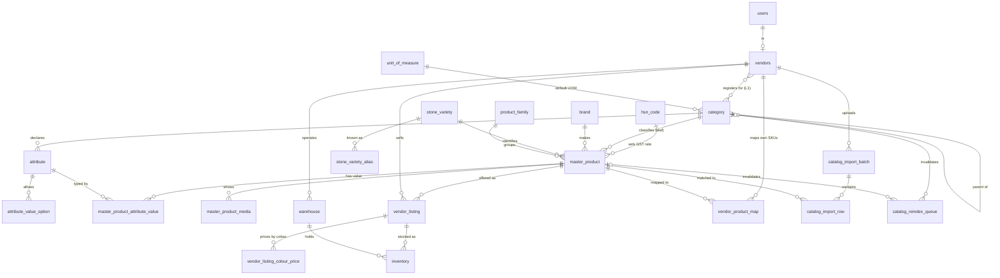

# Catalog Entity Model

Narrative table design and the reasoning behind each column, implementing
[decisions 0001–0016](decisions/README.md).

> **[catalog-schema.sql](catalog-schema.sql) is the canonical DDL.** Where this document and
> the SQL disagree, the SQL wins. This one exists to explain *why* each column is shaped the
> way it is — the SQL cannot carry that.

Both supersede the entity sketch in the root-level
`construction-marketplace-catalog-schema-mvp (2).md`, which predates every decision here.

Columns marked **`NEW`** do not exist in the root draft. Columns marked **`CHANGED`** exist
but are redefined by a decision.

**Not narrated below**, because they are self-explanatory in the DDL: `hsn_code`, `brand`,
`product_family`, `warehouse`, `vendor_product_map`, `catalog_import_batch`,
`catalog_import_row`, `catalog_reindex_queue`. The overview diagram shows how they connect.

---

## 0. Entity relationship overview



`users` and `vendors` already exist; everything else is introduced by this model.

---

## 1. Taxonomy

```sql
unit_of_measure (
  id, code, name,              -- 'bag', 'kg', 'piece', 'sqft', 'metre', 'litre'
  is_active BOOLEAN
)

category (
  id,
  parent_id                 REFERENCES category(id),   -- adjacency; depth ≤ 3
  name,
  slug,
  level                     SMALLINT NOT NULL,   -- NEW  1 | 2 | 3, denormalized
  path                      TEXT     NOT NULL,   -- NEW  'electrical/switchgear/mcb'
  is_leaf                   BOOLEAN  NOT NULL,   -- NEW  only leaves accept products
  unit_of_measure_default_id REFERENCES unit_of_measure(id),
  hsn_code_default,
  external_taxonomy_code,                        -- NEW  Google/Shopify export mapping, nullable
  display_order,
  is_active BOOLEAN,

  CHECK (level BETWEEN 1 AND 3)
)
```

**Why `level` / `path` / `is_leaf` exist.** 0001 caps depth at 3 and attaches products to
leaves only. Adjacency alone answers neither "how deep am I" nor "am I a leaf" without a
recursive query on every read, so both are denormalized. `path` gives breadcrumbs and
prefix-matching for free. At depth ≤ 3 this is cheaper than a closure table.

Invariants (enforce by trigger or in the service layer):

- `level = parent.level + 1`, and `level = 1` exactly when `parent_id IS NULL`
- `is_leaf = NOT EXISTS (SELECT 1 FROM category WHERE parent_id = this.id)`
- `path = parent.path || '/' || slug`

**Vendor scope.** 0001 makes level 1 the shop type, which doubles as vendor registration
scope. The relationship is many-to-many — that is what makes the Plumbing / Sanitaryware
split low-risk, since a shop selling both simply registers for both:

```sql
vendor_category (                                -- NEW
  vendor_id    REFERENCES vendors(id),
  category_id  REFERENCES category(id),          -- must be level = 1
  PRIMARY KEY (vendor_id, category_id)
)
```

## 2. Attributes and inheritance

```sql
attribute (
  id,
  category_id  REFERENCES category(id),  -- CHANGED: the level where it is DECLARED,
                                         -- inherited by all descendants
  code,
  name,                                  -- 'Grade', 'Diameter', 'Amperage', 'Finish'
  data_type,                             -- enum | number | text | boolean
  unit,
  is_variant_defining  BOOLEAN,
  is_searchable_filter BOOLEAN,
  display_order
)

attribute_value_option (
  id, attribute_id, value, display_order
)
```

`category_id` no longer means "this attribute belongs only to this category" — it means
"declared here, applies here and below". `Brand` and `Warranty` are declared at level 1;
`Voltage` on `Wires & Cables`; only genuinely specific fields on leaves. No schema change
was needed for inheritance, only a change of meaning plus a resolution query.

**Effective attribute set for a product** — run at authoring time and when building the
search document, never on a read path:

```sql
WITH RECURSIVE ancestry AS (
  SELECT id, parent_id FROM category WHERE id = :leaf_category_id
  UNION ALL
  SELECT c.id, c.parent_id
  FROM category c JOIN ancestry a ON c.id = a.parent_id
)
SELECT attr.*
FROM attribute attr
JOIN ancestry ON attr.category_id = ancestry.id
ORDER BY attr.display_order;
```

This is the "resolve at write time, not read time" mitigation from 0002 — the flattened
result is what search and the PDP consume, so they see an ETIM-shaped flat list.

> **No `filter_character` column** — [0004](decisions/0004-filter-character-by-category.md)
> decided against it. Lights/Tiles/Stone filters should skew aesthetic (finish, theme,
> colour family) while Electrical/Plumbing skew technical (amperage, pressure rating), but
> that is a guideline for choosing attributes, not a property the schema models. Aesthetic
> attributes are declared *on* the decorative category rather than inherited, so
> `display_order` already controls their prominence.

## 3. Master catalog

```sql
master_product (
  id,
  category_id        REFERENCES category(id),  -- CHANGED: must be is_leaf = true
  product_family_id,
  brand_id,                                    -- nullable for generics
  name, slug,
  product_code,        -- NEW (0011) GA-0012345 — public, permanent, opaque
  gtin,                -- nullable; for catalog dedup + fallback match, not identity
  mfr_part_number, hsn_code,

  gst_rate,            -- NEW (0010) follows the HSN code, never the seller
  country_of_origin,   -- NEW (0010) NOT NULL; searchable + sortable filter
  importer_details,    -- NEW (0010) imported goods only

  sale_unit_type,      -- CHANGED: 'discrete' | 'cut_to_length' | 'tinted_to_order'
  pack_content_qty,    -- with the category's unit of measure

  is_generic BOOLEAN,
  has_natural_variation BOOLEAN,  -- NEW  drives the PDP disclaimer badge
  status,              -- draft | pending_review | live | deprecated

  -- precomputed for search, per search-architecture.md
  cached_best_price,             -- for tinted products: the zero-delta FLOOR
  cached_best_vendor_listing_id,
  cached_updated_at,

  CHECK (NOT is_generic OR brand_id IS NULL)
)

master_product_attribute_value (master_product_id, attribute_id, value)

master_product_media (
  id, master_product_id, url, type,   -- image | spec_sheet_pdf | certification_doc
  display_order, is_primary BOOLEAN,
  is_representative BOOLEAN           -- NEW  indicative of the variety, not a specific item
)
```

Two constraints carry decisions:

- **Leaf-only attachment** (0001). Attaching to a non-leaf makes attribute resolution
  ambiguous and distorts browse counts.
- **`has_natural_variation`** (0003) is a flag, not stone-specific copy, because it
  generalizes — tiles carry shade-variation ratings (V3/V4), and laminate and wood vary by
  batch. The disclaimer text lives in the UI; the schema records only that one is needed.

## 4. Paint colour — no shade table

**There is no paint shade entity** ([0014](decisions/0014-batch-resolutions.md)). Neither
shade nor `Base Type` enters `attribute` / `attribute_value_option`, and neither has a table
of its own.

1,800+ shades per brand is a recurring ETL job against shade cards, for data the platform
does not transact on. Price is per **colour family** (0007), and the exact shade is settled
between customer and vendor at the counter using the vendor's physical fan deck — which is
how Indian paint buying already works.

Line price for a tinted product — no shade join, no arithmetic, computed in **one place**:

```sql
resolve_unit_price(vendor_listing_id, colour_family)

--   unit_price = vendor_listing_colour_price.price   -- absolute, per colour
--
--   colour_family NULL → vendor_listing.price, the "from ₹X" floor
--   RETURNS NULL       → vendor does not offer that colour
```

Price display, the cart, order lines and `cached_best_price` all call this function.
Reimplementing the logic per call site is how a product page and a cart end up disagreeing.

The vendor-level delta is **colorant cost**, which is product-independent — 20L of deep blue
uses the same colorant whether the base is a premium or economy line. The per-listing
override exists for **margin**, which is not: a shop may charge more to tint a premium line
([0015](decisions/0015-per-vendor-colour-delta.md)).

The order line carries `{ colour_family, reference_hex?, note? }`. `reference_hex` is a
visual hint only — a tinting machine dispenses from a shade code, never from an RGB value.

**Dropped along the way:** `paint_shade_base_compatibility` and `paint_colorant_delta` by
0007, when base stopped being priced and pricing moved to the vendor; `paint_shade` itself
by 0014.

## 5. Stone varieties

Stone has no GTIN and no manufacturer part number — a variety is a **trade name** tied to a
quarry region. `master_product` for stone is *variety + finish + thickness*, e.g. "Black
Galaxy Granite, Polished, 18mm", with `is_generic = true` and `brand_id IS NULL`.

```sql
stone_variety (                                  -- NEW
  id, name, slug,
  stone_type,        -- granite | marble | kota | sandstone | …
  origin_region,     -- quarry region, e.g. 'Andhra Pradesh'
  is_active
)

stone_variety_alias (                            -- NEW
  id, stone_variety_id, alias   -- normalized lowercase; drives import matching
)
```

`stone_variety_alias` exists because the draft match order (*exact GTIN → MPN → structured
→ fuzzy*) has its entire top half unavailable for stone, while vendors upload "Black
Galaxy", "black galexy", "BG Granite", "Galaxy Black". Match order for stone becomes
**variety alias exact → fuzzy name**, and rows default to `needs_review` rather than
`auto_matched` unless an alias matches exactly.

Stone is the only category needing a reference table of this kind — a lookup for values
that are neither attributes nor SKUs.

## 6. Vendor listing and inventory

```sql
vendor_listing (
  id, vendor_id, master_product_id, vendor_sku,
  price, mrp,
  min_order_qty,
  supports_tinting BOOLEAN,    -- NEW (provisional — open question 2 of 0002)
  price,                      -- NOT NULL; untinted price for paint
  stated_grade,               -- vendor's own grade label; part of listing identity
  -- gst_rate REMOVED (0010) — moved to master_product; GST follows HSN, not the seller
  status,                      -- active | paused | out_of_stock
  serviceable_pincodes / radius_km,
  updated_at
)

vendor_listing_colour_price (                    -- NEW (0007, 0016)
  vendor_listing_id,
  colour_family,      -- ENUM
  price,              -- ABSOLUTE. no delta, no arithmetic
  PRIMARY KEY (vendor_listing_id, colour_family)
)

-- One listing per vendor per product PER GRADE (0009), so a stone yard can quote
-- Grade A and commercial grade at different rates, as its price list does.
CREATE UNIQUE INDEX vendor_listing_unique
  ON vendor_listing (vendor_id, master_product_id, COALESCE(stated_grade, ''));

inventory (
  id, vendor_listing_id, warehouse_id,
  quantity_available, quantity_reserved,
  updated_at
)
```

**`stated_grade` is free text and part of listing identity** ([0009](decisions/0009-stone-price-list-model.md)).
Free text because granite grading is not standardized — the same word means different things
by origin, so an enum would manufacture cross-vendor comparability that does not exist. Part
of identity because Indian stone price lists quote per grade, so one Excel row per grade
becomes one listing.

**There is no vendor-supplied imagery anywhere in the model.** The master catalog carries
admin-curated representative images and nothing else. A bundle tier with vendor lot photos
was designed in [0008](decisions/0008-stone-bundle-tier.md) and reverted — the capability
was removed rather than scoped, which also eliminates the moderation queue.

**Paint is the exception to `inventory`.** A paint listing is now a product line + pack size
rather than a bucket of base, so there is nothing countable — a vendor holding 12 buckets
across four bases cannot express that against one listing. For paint,
`vendor_listing.status` carries availability and `inventory` rows are not required
([0007](decisions/0007-colour-family-pricing.md)). Every other category counts normally.

## 7. Order line — where configuration lands

```sql
order_item (
  id, order_id,
  vendor_listing_id, master_product_id,
  quantity,
  unit_price,             -- snapshot
  configuration jsonb,    -- NEW
  line_total
)
```

`configuration` generalizes across every made-to-order `sale_unit_type`, which is why 0002
reused the existing concept rather than inventing a paint-specific one:

| `sale_unit_type` | `configuration` payload | inventory decrements |
|---|---|---|
| `discrete` | `null` | the SKU itself |
| `cut_to_length` | `{ length_m }` | coil stock, in metres |
| `tinted_to_order` | `{ colour_family, reference_hex?, note? }` | nothing — paint has no `inventory` rows |

The shade fields are **snapshotted, not merely referenced**. Shade cards get revised and
shades get discontinued; a bare foreign key would let a historical order silently change
colour or dangle.

## 8. Search document

Per `search-architecture.md`, with two additions from these decisions:

```json
{
  "id": "master_product_id",
  "name": "Asian Paints Royale Luxury Emulsion, 20L",
  "category_path": "paint/interior-emulsion",
  "brand": "Asian Paints",
  "attributes": { "sheen": "matt", "washability": "high" },
  "shade_families": ["beige", "grey", "blue"],
  "price_is_from": true,
  "cached_best_price": 4200,
  "in_stock": true,
  "serviceable_pincodes": ["380001", "…"]
}
```

- `attributes` is the **flattened** effective set — inheritance already resolved.
- `shade_families` carries colour-family faceting without indexing 1,800 individual shades.
- `price_is_from` tells the UI to render "from ₹4,200". Without it paint appears cheaper in
  search than it can actually be bought, since `cached_best_price` is the zero-delta floor.

---

## Open items reflected above

| Column / table | Status | Tracked in |
|---|---|---|
| `vendor_listing.supports_tinting` | Provisional | 0002 open question 2 |
| Custom / computer-matched shades | No home in `configuration` yet | 0002 open question 1 |
| Colour-family price per listing vs. per vendor | Per-listing modelled; may be tedious | 0007 open question 1 |
| Shade whose family a vendor hasn't priced | Hide, or show unavailable | 0007 open question 2 |
| Normalized grade band for filtering | Deferred, not rejected | 0003 open question 1 |
| Lot-level `inventory` | Post-MVP | 0003 open question 2 |
| Sample-request flow | No home in the schema | 0003 open question 3 |
| Wastage on the order line | UI concern for now | 0003 open question 4 |

`attribute.filter_character` was proposed in an earlier revision of this document and
**removed** by [0004](decisions/0004-filter-character-by-category.md).
