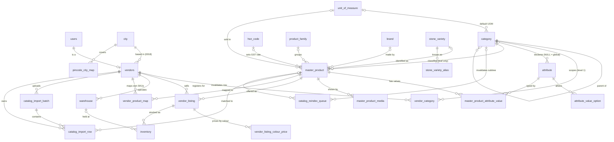
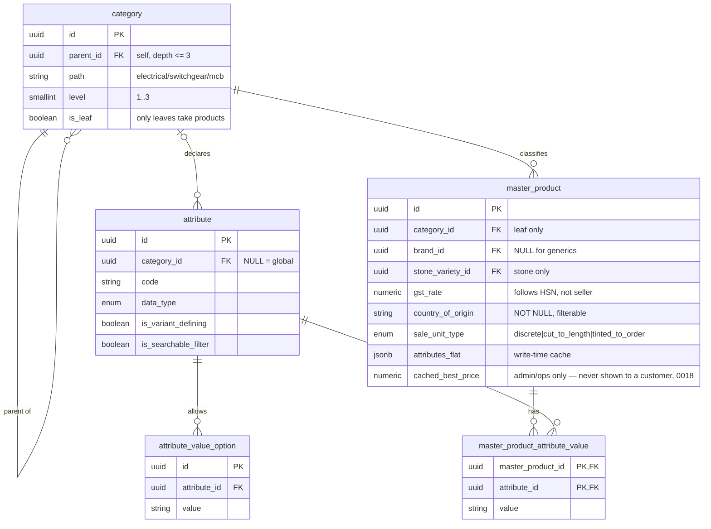
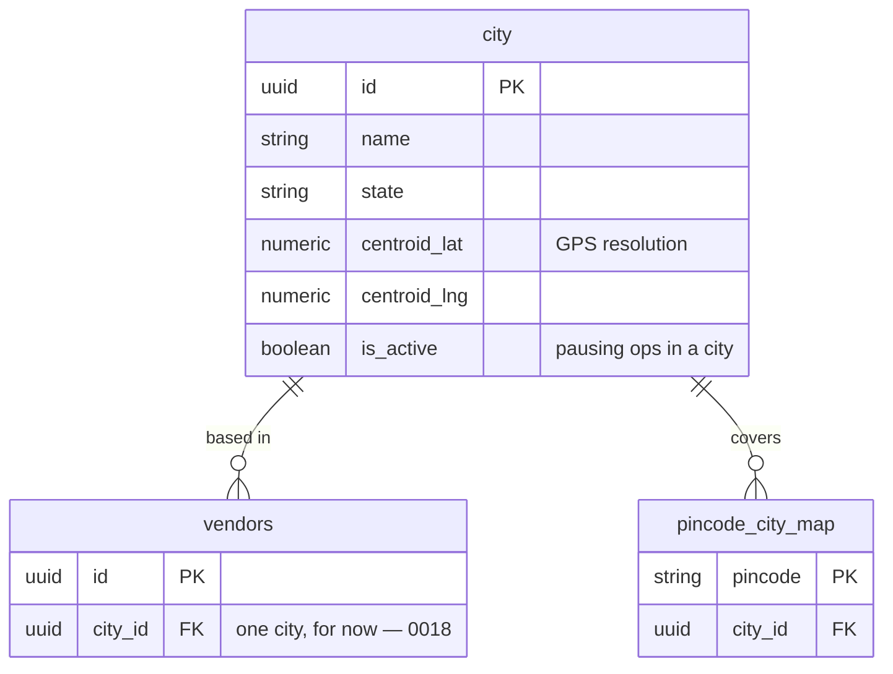
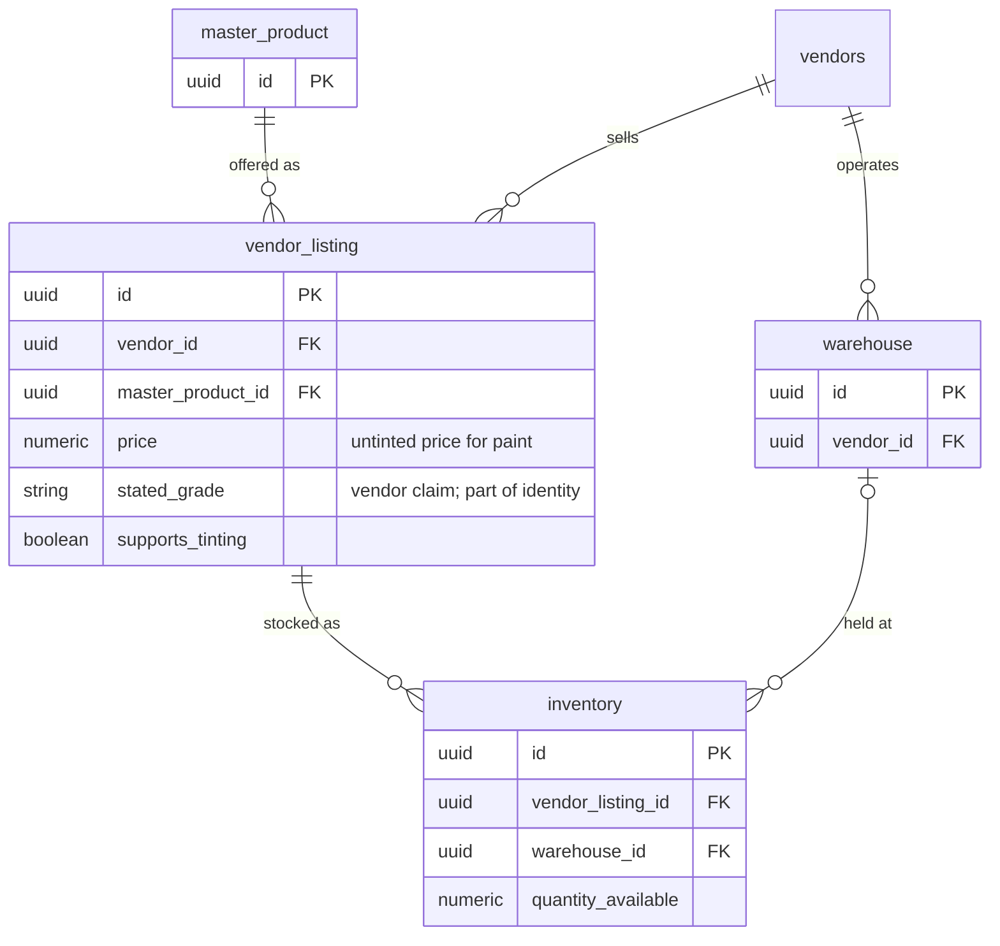
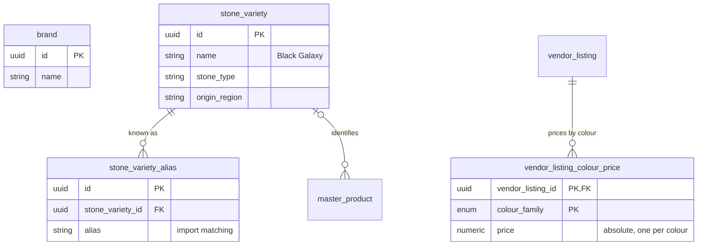

# Catalog ER Diagram

Entities and relationships for the product catalog, derived from
[catalog-schema.sql](catalog-schema.sql). 23 tables, 33 relationships — 32 foreign keys
defined in the schema file, plus the pre-existing `users` → `vendors` link.

`users` and `vendors` already exist in the codebase; everything else is new, **except
`vendors.city_id`** — decision [0018](decisions/0018-city-scoped-search.md) adds that one
column to the existing `vendors` table. See its consequences section before treating this
diagram as docs-only.

**Cardinality legend** — `||` exactly one · `|o` zero or one (nullable FK) ·
`o{` zero or more.

---

## Full model

---

## Core catalog — the spine

The composite primary key on `master_product_attribute_value` means one value per
attribute per product — no multi-valued attributes. `attributes_flat` is the derived
JSONB of the same data with inheritance already resolved.

---

## Geography — 0018, one document per (product, city)

`serviceable_pincodes` / `service_radius_km` (per-listing, on `vendor_listing`) are
**removed** by this decision — a vendor doesn't serve a different area per product. `city_id`
lives once, on `vendors`. Customer location (pincode or GPS) resolves to one `city_id`
*before* any product query runs; see [0018](decisions/0018-city-scoped-search.md).

---

## Vendor side — offers, stock, imagery

`UNIQUE (vendor_id, master_product_id, COALESCE(stated_grade, ''))` — one listing per vendor
per product **per grade**, so a stone yard can quote Grade A and commercial grade at
different rates. `COALESCE` is required because Postgres treats NULLs as distinct.
`UNIQUE (vendor_listing_id, warehouse_id)` on inventory allows stock split across branches.

Paint is the only category that does not use `inventory` — a paint listing is a product line
rather than a countable bucket of base. Everything else, stone included, counts normally.

---

## Stone reference data, and paint colour pricing

`stone_variety` holds no product rows — it is a lookup table for values that are neither
attributes nor SKUs, which is why it does not violate the single-table product model. It is
referenced *from* `master_product`, because for stone the variety trade name **is** the
product's identity.

**Paint has no equivalent table.** A `paint_shade` entity was designed in 0002 and dropped
in 0014: 1,800+ shades per brand is a recurring ETL job for data the platform does not
transact on. Price is per colour family, and the exact shade is settled between customer and
vendor at the counter. `colour_family` is a Postgres enum, so `vendor_listing_colour_price`
needs nothing to join against.

---

## Full relationship reference

| # | Parent | Child | FK column | Card. | On delete |
|---|---|---|---|---|---|
| 1 | users | vendors | user_id | 1:1 | CASCADE |
| 2 | category | category | parent_id | 1:N | RESTRICT |
| 3 | unit_of_measure | category | unit_of_measure_default_id | 0..1:N | — |
| 4 | vendors | vendor_category | vendor_id | 1:N | CASCADE |
| 5 | category | vendor_category | category_id | 1:N | RESTRICT |
| 6 | category | attribute | category_id | 0..1:N | CASCADE |
| 7 | attribute | attribute_value_option | attribute_id | 1:N | CASCADE |
| 8 | category | master_product | category_id | 1:N | RESTRICT |
| 9 | product_family | master_product | product_family_id | 0..1:N | SET NULL |
| 10 | brand | master_product | brand_id | 0..1:N | RESTRICT |
| 11 | stone_variety | master_product | stone_variety_id | 0..1:N | RESTRICT |
| 12 | unit_of_measure | master_product | unit_of_measure_id | 0..1:N | — |
| 13 | master_product | master_product_attribute_value | master_product_id | 1:N | CASCADE |
| 14 | attribute | master_product_attribute_value | attribute_id | 1:N | RESTRICT |
| 15 | master_product | master_product_media | master_product_id | 1:N | CASCADE |
| 16 | stone_variety | stone_variety_alias | stone_variety_id | 1:N | CASCADE |
| 17 | vendors | vendor_listing | vendor_id | 1:N | CASCADE |
| 18 | master_product | vendor_listing | master_product_id | 1:N | RESTRICT |
| 19 | vendor_listing | vendor_listing_colour_price | vendor_listing_id | 1:N | CASCADE |
| 20 | vendors | warehouse | vendor_id | 1:N | CASCADE |
| 21 | vendor_listing | inventory | vendor_listing_id | 1:N | CASCADE |
| 22 | warehouse | inventory | warehouse_id | 0..1:N | SET NULL |
| 23 | vendors | catalog_import_batch | vendor_id | 1:N | CASCADE |
| 24 | catalog_import_batch | catalog_import_row | import_batch_id | 1:N | CASCADE |
| 25 | vendors | catalog_import_row | vendor_id | 1:N | CASCADE |
| 26 | master_product | catalog_import_row | matched_master_product_id | 0..1:N | SET NULL |
| 27 | category | catalog_reindex_queue | category_id | 0..1:N | CASCADE |
| 28 | master_product | catalog_reindex_queue | master_product_id | 0..1:N | CASCADE |
| 29 | hsn_code | master_product | hsn_code | 0..1:N | — |
| 30 | vendors | vendor_product_map | vendor_id | 1:N | CASCADE |
| 31 | master_product | vendor_product_map | master_product_id | 1:N | CASCADE |
| 32 | city | vendors | city_id | 1:N | RESTRICT *(0018 — new column on an existing table)* |
| 33 | city | pincode_city_map | city_id | 1:N | RESTRICT |

---

## Relationships that are NOT foreign keys

Three links exist logically but are deliberately not enforced:

**`master_product.cached_best_vendor_listing_id`** has no FK. A real one would be circular
— `master_product` → `vendor_listing` → `master_product` — which makes inserts and deletes
order-dependent for a value that is a denormalized cache. It is refreshed by the same
write-time process as `cached_best_price`, and a stale pointer is tolerable where a
deadlock is not.

**`master_product_attribute_value.value` → `attribute_value_option.value`** is validated in
the service layer, not by FK. An FK would only be meaningful for `data_type = 'enum'`, so it
would be a partial constraint covering some rows and not others. Open question 2 of
[0005](decisions/0005-attribute-storage-and-identity-columns.md).

**`order_item` paint colour** is carried entirely in the `configuration` JSONB —
`{ colour_family, reference_hex?, note? }` — with nothing to reference, since there is no
shade table ([0014](decisions/0014-batch-resolutions.md)). `reference_hex` is a visual hint,
not an orderable identifier.

## Constraints not visible as relationships

- **Leaf-only attachment** — `master_product.category_id` must reference a category with
  `is_leaf = true`, enforced by trigger, plus a second trigger stopping a leaf from gaining
  a child while products are attached ([0006](decisions/0006-constraint-and-cache-invalidation-mechanisms.md)).
- **`vendor_category.category_id` must be level 1** — shop-type scope, enforced in the
  service layer.
- **`is_generic` ⟹ `brand_id IS NULL`** — a CHECK constraint.
- **Paint listings carry no `inventory` rows** — availability is expressed through
  `vendor_listing.status`, because a paint listing is a product line rather than a
  countable bucket of base ([0007](decisions/0007-colour-family-pricing.md)).
