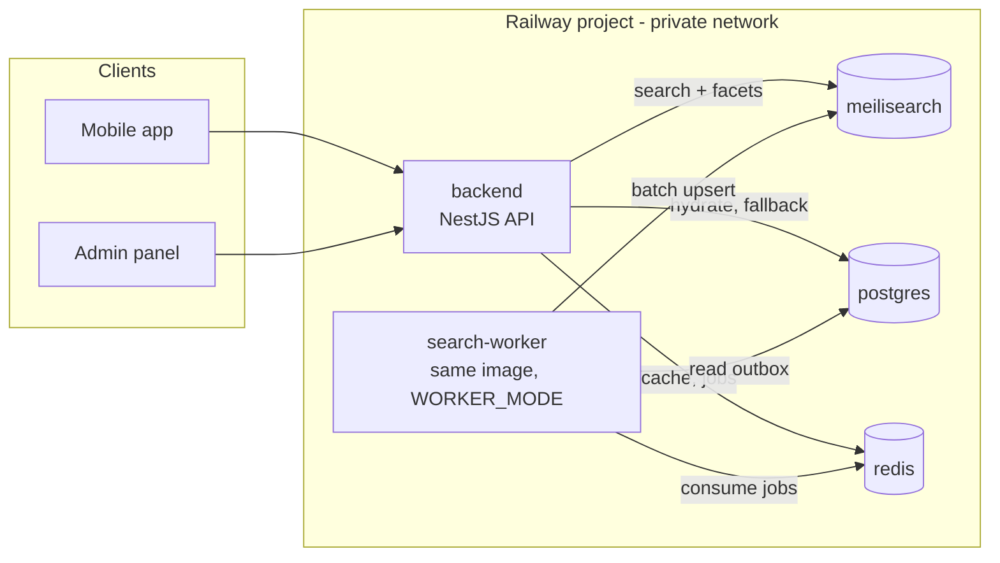
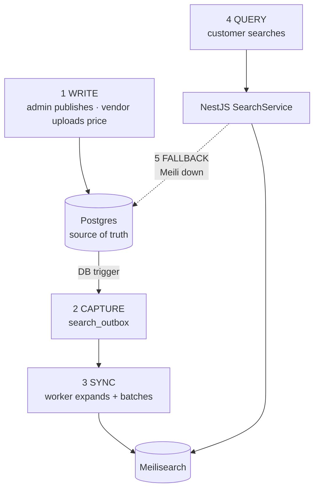
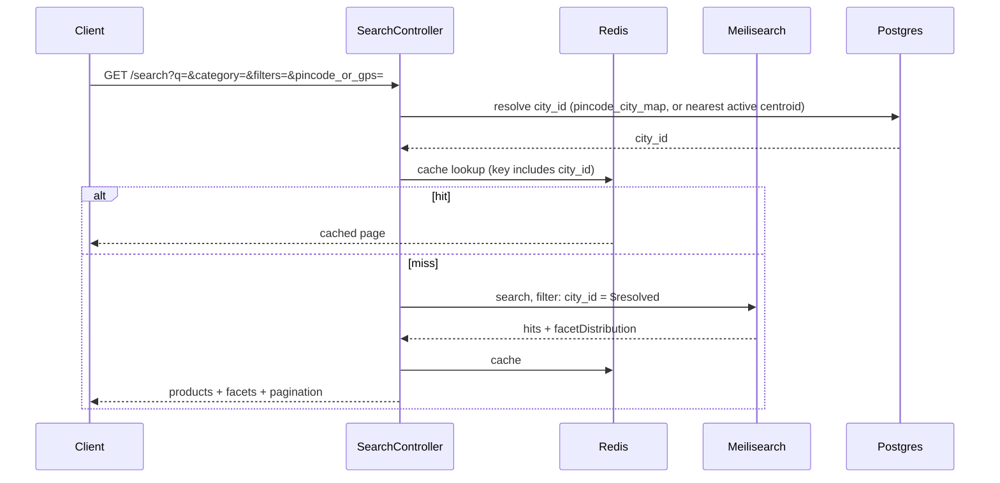

# Search System Design — Meilisearch

How search fits into the Golden Abode stack: services, change capture, sync, query path,
and failure behaviour.

Read alongside:

- [search-architecture.md](../search-architecture.md) — the original stack choice (Postgres → engine)
- [catalog-schema.sql](catalog-schema.sql) — canonical DDL for the catalog, including the
  `city` / `pincode_city_map` geography tables
- [search-schema.sql](search-schema.sql) — **canonical DDL for search sync**, authoritative
  over the SQL excerpts in this document
- [decisions/0017-search-engine-choice.md](decisions/0017-search-engine-choice.md) — why Meilisearch
- [decisions/0018-city-scoped-search.md](decisions/0018-city-scoped-search.md) — **S1,
  resolved:** one document per `(product, city)`

> **S1 is resolved (0018).** The business is city-scoped — every search is local vendors
> in the customer's city, never cross-city — so the document grain is
> `(master_product, city)`, ID `{product_id}:{city}`, and a product with no local vendor has
> **no document** for that city at all. Sections 5 and 6 below reflect this.

---

## 1. Services

Meilisearch is one more container. Railway already runs everything else.



**Meilisearch is never exposed publicly.** Railway private networking means it is reachable
only at `meilisearch.railway.internal`, so the master key never crosses the internet and
there is no public port to secure.

| Service | New? | Notes |
|---|---|---|
| `backend` | existing | gains a `SearchModule` |
| `meilisearch` | **new** | official image, private port only |
| `search-worker` | **new** | *same Docker image as backend*, different start command |
| `postgres` · `redis` | existing | Redis is already wired as a `@Global()` module |

The worker is the same image deliberately — it shares Sequelize models and the document
builder. A separate repo or image would duplicate both and they would drift.

> **Launch shortcut:** run the worker in-process inside `backend` behind a flag, and split
> it into its own Railway service when a bulk reindex first starts competing with API
> latency. The code is identical either way; only the start command changes.

---

## 2. The five paths



Postgres stays the source of truth for every write. Meilisearch is a **derived, disposable
index** — it can be deleted and rebuilt from Postgres at any time. Nothing is ever written
to Meilisearch first.

---

## 3. Change capture — outbox, not ORM hooks

### Why not Sequelize hooks

The obvious approach is a Sequelize `afterSave` hook that pushes to Meilisearch. It is
wrong here for a specific reason: **the bulk Excel import paths bypass the ORM.** Vendor
inventory upload, admin catalog seeding and `drain_catalog_reindex_queue()` all write in
bulk or in SQL. An ORM hook silently misses exactly the writes that change the most rows.

Database triggers see every write regardless of what issued it. The schema already uses
this pattern for `attributes_flat`, so it is a shape the team will recognise.

### Statement-level, not row-level

A row-level trigger can cover all three events in one declaration, which is fewer lines.
It also fires **once per row**. A vendor uploading 500 paint price rows would invoke the
function 500 times and write 500 outbox rows for perhaps 50 distinct products.

Statement-level triggers with transition tables (Postgres 10+; this project runs 16) fire
**once per statement** and write one deduplicated `INSERT … SELECT DISTINCT`.

| | Row-level | **Statement-level** |
|---|---|---|
| Trigger declarations | 12 | **26** |
| Invocations for a 500-row upload | 500 | **1** |
| Outbox rows written | 500 | **~50** (distinct product/city pairs) |

The trigger count is forced by Postgres, not by preference:

> *"Multiple events can be specified using `OR`, except when transition relations are
> requested."* — PostgreSQL 16, `CREATE TRIGGER`

So each event needs its own trigger. All 26 share just **three** functions — a third was
added by [0018](decisions/0018-city-scoped-search.md), for reasons below — and the DDL is
written once.

### `search_outbox`

Full DDL: **[search-schema.sql](search-schema.sql)**, which is canonical for search sync
the way [catalog-schema.sql](catalog-schema.sql) is canonical for the catalog.

```sql
CREATE TABLE search_outbox (
  id           BIGSERIAL PRIMARY KEY,
  entity_type  TEXT NOT NULL CHECK (entity_type IN (
                 'master_product', 'brand', 'category',
                 'stone_variety', 'city', 'all')),
  entity_id    UUID,                    -- NULL only for 'all'
  city_id      UUID REFERENCES city(id) ON DELETE RESTRICT,  -- see below
  reason       TEXT NOT NULL,
  enqueued_at  TIMESTAMPTZ NOT NULL DEFAULT NOW(),
  processed_at TIMESTAMPTZ,
  CONSTRAINT search_outbox_target CHECK (
    (entity_type =  'all' AND entity_id IS NULL) OR
    (entity_type <> 'all' AND entity_id IS NOT NULL))
);
```

`BIGSERIAL`, the `enqueued_at` / `processed_at` pair and the scope `CHECK` deliberately
mirror `catalog_reindex_queue` — same shape, same drain semantics, one pattern to learn.

It differs in being **polymorphic on `entity_id`**: `catalog_reindex_queue` has two targets
and can afford typed, foreign-keyed columns throughout. This has several, so `entity_id`
carries no foreign key — no `ON DELETE CASCADE`, so the worker must tolerate an `entity_id`
that no longer exists. That turns out to be the **delete path** rather than a defect
(below).

`city_id` is a *different* kind of column — typed and foreign-keyed, because `city` rows
are not deleted in the ordinary course of business. It is populated only when a trigger can
name the specific city a change affects; `NULL` means "work it out from current state at
drain time." Why that distinction exists is section 5.1 of
[0018](decisions/0018-city-scoped-search.md), and it is the reason a third trigger function
exists at all.

### The unit is `(product, city)`, not product — decision 0018

**The row records what changed, not which documents to rebuild.** A `vendor_listing` price
change dirties one `(product, city)` pair — but renaming a brand dirties every pair beneath
it. If the trigger enqueued pairs directly, renaming one row could write thousands inside
that transaction.

Child tables enqueue the **parent they can be resolved from**, not themselves — so the
outbox never holds an entity type that cannot be expanded later:

| Trigger source | Enqueues | Worker expands to |
|---|---|---|
| `master_product` | `master_product`, `city_id` **NULL** | that product, *every current city it's listed in* |
| `master_product_attribute_value` | `master_product`, `city_id` NULL | same |
| `master_product_media` | `master_product`, `city_id` NULL | same |
| `vendor_listing` | `master_product` **+ its vendor's `city_id`, resolved now** | exactly that one pair |
| `vendor_listing_colour_price` | `master_product` + `city_id` *(via join)* | that listing's exact pair |
| `inventory` | `master_product` + `city_id` *(via join)* | that listing's exact pair |
| `stone_variety_alias` | `stone_variety` | all products of that variety, their current cities |
| `brand` | `brand` | **all products of that brand**, their current cities |
| `category` | `category` | **the whole subtree** (`path LIKE 'x/%'`), their current cities |
| `stone_variety` | `stone_variety` | **all products of that variety**, their current cities |
| `city` *(rename/deactivate)* | `city` | **every product currently listed in that city** |
| `vendors` *(relocation, `UPDATE OF city_id`)* | `city` **× 2** (old + new) | products listed by that vendor, in both cities |

Four details that are easy to get wrong, the last one added by 0018:

- **`vendor_listing` enqueues its product, not itself.** On delete the listing is gone, so
  a `vendor_listing` entity could never be resolved back to a product at drain time.
- **The `UPDATE` branch reads both transition tables.** A re-match moves a listing to a
  different product, and the *old* product needs reindexing just as much as the new one.
- **Cascade-orphaned child triggers find nothing, and that is correct.** Deleting a listing
  fires its own trigger, which already enqueued the product. The cascade path is redundant,
  not load-bearing.
- **`vendor_listing`'s trigger resolves `city_id` at trigger time, not later.** A vendor's
  *last* listing for a product in a city, on `DELETE`, is exactly the row that knows which
  city just lost coverage. Re-deriving it later from "what listings still exist" would find
  nothing — the row that knew is the row that's gone — and silently leave a ghost document
  in the index forever, with no error anywhere. This is why `vendor_listing` gets its own
  trigger function instead of sharing the generic one; see `search-schema.sql` §2b for the
  full argument.

### `UPDATE OF` only where the trigger fans out

> **Rule:** restrict the column list on fan-out sources. Leave 1:1 sources bare.

A bare `AFTER UPDATE ON brand` reindexes every Havells product because someone touched
`updated_at`. On a 1:1 source the same over-firing costs *one* redundant rebuild — not
worth maintaining a column list that silently rots as columns are added.

So `brand`, `category` and `stone_variety` name their columns; nothing else does. Those
three also need **no `INSERT` or `DELETE` trigger** — a new brand has no products yet, and
all three are `ON DELETE RESTRICT` from `master_product`, so a row with products cannot be
deleted.

### The delete path

Expansion returns **candidate `(product, city)` pairs**, not documents. The worker checks
every pair against current state in one query — re-verified fresh, never assumed from how
the pair was discovered:

```sql
SELECT candidate.master_product_id, candidate.city_id
FROM (candidate pairs) AS candidate(master_product_id, city_id)
JOIN master_product mp ON mp.id = candidate.master_product_id AND mp.status = 'live'
JOIN city            c ON c.id = candidate.city_id            AND c.is_active
WHERE EXISTS (
  SELECT 1 FROM vendor_listing vl
  JOIN vendors v ON v.id = vl.vendor_id
  WHERE vl.master_product_id = candidate.master_product_id
    AND v.city_id = candidate.city_id
);
```

Every pair **absent** from that result is deleted from Meilisearch (`{product_id}:{city_id}`
is the document ID, so this needs no filtered delete — just the ID). One query covers four
cases with no special handling:

| Case | Result |
|---|---|
| product row deleted, or status moved off `live` | absent → `deleteDocument` |
| the city was deactivated | absent → `deleteDocument` |
| no vendor_listing remains for that vendor in that city | absent → `deleteDocument` |
| product still live, city active, a listing exists | present → `addDocuments` |

This is why the missing foreign key on `entity_id` is not a defect, and why `city_id` is
captured early on `vendor_listing` events specifically: an `entity_id` (or a `city_id`)
pointing at something already gone is precisely the signal to remove the document — but
only if the candidate pair made it into the batch to check in the first place.

### Feeding from the existing queue

`drain_catalog_reindex_queue()` rebuilds `attributes_flat` in bulk via an `UPDATE` on
`master_product` — which fires `trg_mp_search_upd` automatically. Already handled,
**provided the drain never runs with `search.suppress_outbox` set.**

Suppression exists only for the initial seed, where 4,000 SKUs should not become 4,000
outbox rows drained one document at a time:

```sql
BEGIN;
  SELECT set_config('search.suppress_outbox', 'on', true);   -- txn-local
  ... bulk writes ...
COMMIT;
INSERT INTO search_outbox (entity_type, reason) VALUES ('all', 'bulk seed');
```

Mirrors the existing `flat_rebuild_suppressed()` escape hatch exactly. Get this wrong — set
suppression somewhere it does not belong — and Postgres is correct while Meilisearch is
stale, with **nothing raising an error**. That is the failure mode this whole section
exists to prevent, which is why `search_outbox_backlog` is a view and not an afterthought.

---

## 4. Sync worker

BullMQ on the Redis that is already running. One new dependency (`bullmq`,
`@nestjs/bullmq`) and one new queue.

```
cutoff := NOW()                       ← taken FIRST; everything hinges on it
      │
      ▼
search_outbox_try_lock()              ← advisory lock, one drainer at a time
      │
      ▼
expand_search_outbox(cutoff)          ← SQL: entity rows → distinct (product, city) pairs
      │
      ▼
EXISTS-check every pair against live vendor_listing + city.is_active
      │                        │
   present                  absent
      ▼                        ▼
addDocuments(batch)     deleteDocuments(ids)   ← id = `{product}:{city}`, no query needed
      │                        │
      └────────────┬───────────┘
                   ▼
    mark_search_outbox_processed(cutoff)
```

**Expansion is SQL; batching and HTTP are TypeScript.** The fan-outs are set operations —
a category subtree is a prefix match against `idx_category_path`, which already exists —
so doing them in TypeScript would mean pulling IDs over the wire to no purpose.

| Concern | Setting | Why |
|---|---|---|
| Poll interval | 2 s | Price freshness a customer would never notice |
| Batch size | up to 1,000 docs | Meilisearch prefers batched adds over per-document calls |
| Dedupe | `UNION` inside `expand_search_outbox` | A vendor editing 40 prices dirties one product 40 times |
| Concurrency | `pg_try_advisory_lock` | A rolling Railway deploy briefly runs two workers |
| Retry | BullMQ exponential backoff | `processed_at` stays NULL until the task succeeds |
| Ordering | not required | Documents are upserted whole, so last write wins correctly |

### Why the cutoff is taken first

It is the entire concurrency argument, and it is the same trick
`drain_catalog_reindex_queue()` already uses.

Changes arriving **during** a drain land with `enqueued_at > cutoff`, so
`mark_search_outbox_processed(cutoff)` does not touch them and the next cycle picks them
up. Worst case a document is rebuilt twice. **It is never left stale** — which matters
because a stale document raises no error and nobody finds out until a customer sees a wrong
price.

Rows are marked processed only after Meilisearch has accepted every batch for that cutoff.
A crash mid-drain re-delivers the whole cutoff window, and re-indexing a document that is
already correct is harmless.

### `'all'` does not go through this path

A full-rebuild marker is excluded from `expand_search_outbox` deliberately. Expanding it
would push 6,000 documents through the incremental path and leave the live index
half-updated for the duration. It routes to the **shadow index + atomic swap** job instead
(section 7).

---

## 5. Index topology

**One index: `products`.** Not one per category, and — per 0018 — **not one per city
either.** `city` is a filter value on a shared index, exactly like `category` or `brand`.

Facets in Meilisearch are a *query-time* parameter, not an index-time structure — the
`facets` argument returns a `facetDistribution` scoped to the current result set. So
per-category facets (which differ across all 58 leaves) are handled by the query layer
asking for different facet fields once the category is known. Splitting the index per
category (or per city) would buy nothing and would break cross-category search, which is
the main search box.

### Document identity: `{product_id}:{city_id}`

Decided in [0018](decisions/0018-city-scoped-search.md). One document per
`(master_product, city)` pair — never one product document with per-city nested data.

```ts
interface SearchDocument {
  id: string;              // `${masterProductId}:${cityId}` — deterministic, never generated
  master_product_id: string;
  city_id: string;
  name: string;
  category_path: string;
  brand: string | null;
  attributes: Record<string, string | number | boolean>;
  price: number;                    // cheapest ACTIVE listing among vendors in this city
  cheapest_vendor_listing_id: string;  // which listing that price came from
  vendor_count: number;             // how many vendors in this city carry it
  in_stock: boolean;
  updated_at: string;
}
```

### `price` is a city-scoped best price, computed at build time — not dropped

Worth stating plainly, because it is easy to read "the global `cached_best_price` column is
retired" as "best price is gone." It is not — it **moved**, from one global column on
`master_product` to this field, recomputed per `(product, city)` every time the document is
rebuilt:

```sql
-- search-document.builder.ts runs exactly this shape for every (product, city) pair
-- it (re)builds. Same catalog-schema.sql indexes already cover it:
-- idx_vendor_listing_product (master_product_id, status) and vendors(city_id).
SELECT
  MIN(vl.price)                                    AS price,
  (ARRAY_AGG(vl.id ORDER BY vl.price))[1]           AS cheapest_vendor_listing_id,
  COUNT(*)                                          AS vendor_count
FROM vendor_listing vl
JOIN vendors v ON v.id = vl.vendor_id
WHERE vl.master_product_id = $1
  AND v.city_id = $2
  AND vl.status = 'active';
```

This is the same "cheapest among vendors" idea `master_product.cached_best_price` always
computed — just scoped to the one city that's ever relevant to a given customer, instead of
globally. The Meilisearch document **is** the cache; there is no separate Postgres
`cached_best_price_by_city` column, because the search index already serves that role and
a second cache would just be one more place for staleness to hide.

**PDP reads the same number, by ID, not by re-querying.** Given a resolved `city_id` and a
`product_id`, the product page fetches `products/{product_id}:{city_id}` directly from
Meilisearch — no search query, no ranking, just a document `GET`. That reuses the exact
figure shown in search results instead of computing it twice, and it is what replaces the
old *"search results and initial PDP load read `cached_best_price` directly"* behaviour
from `search-architecture.md`, now correctly scoped to one city.

**The live join is still there for exactly one case**, unchanged from the original design:
comparing vendors within a product page. `vendor_count` tells the UI whether that toggle is
worth showing at all — no point rendering a "compare N vendors" affordance when
`vendor_count` is 1.

**Why the ID is deterministic rather than server-generated:** it makes the delete path a
plain ID list. No `deleteByFilter`, no query construction — the worker computes the same ID
it would use to upsert, and either calls `addDocuments` or `deleteDocuments` with it. See
[search-schema.sql](search-schema.sql) section 5 for how a candidate `(product, city)` pair
becomes one or the other.

A product with no live vendor in a city has **no document** for that pairing — confirmed
directly, not inferred: *"if product is not at local vendor then don't show."* No
placeholder, no cross-city fallback result; absence from the index is the entire mechanism.

Settings are **code, applied idempotently on boot** — not clicked into a dashboard.

```ts
// meili.indexes.ts — the single source of truth for index configuration
export const PRODUCTS_INDEX = 'products';

export const productsSettings = {
  searchableAttributes: [ /* ordered: earlier = higher weight */ ],
  filterableAttributes: [ 'city_id', 'category_path', 'brand', 'attributes.*', /* … */ ],
  sortableAttributes:   [ 'price', 'updated_at' ],   // plain fields — no per-city variants
  typoTolerance: {
    // VERIFIED against Meilisearch docs: prevents 32A matching 32B.
    disableOnNumbers: true,
  },
};
```

Settings drift between environments is otherwise guaranteed, and the symptom — "staging
ranks differently to production" — is miserable to diagnose.

`city_id` is filtered on **every** query, never optional. There is no "search all cities"
mode — that would contradict the business model this decision encodes, not just be an
unused feature.

### Numeric typo tolerance is the one setting that must not be missed

Construction search is full of numbers where a one-character edit is a *different product*:

| Query | Must not match |
|---|---|
| `32A MCB` | `32B` curve, `16A` |
| `2.5 sq mm` | `1.5 sq mm` |
| `600x600 tile` | `600x300` |

Meilisearch's documented behaviour is that with `disableOnNumbers` enabled, *"queries with
numbers only return exact matches"*. Default typo tolerance allows one typo at 5–8
characters and two at 9+, which would actively produce wrong results across this catalog.

---

## 6. Query path



**No Postgres price hop on the read path anymore.** `price` is a plain field on the
document itself — resolved once, when the document was built, not re-fetched per query.
This is the direct payoff of the per-`(product, city)` document (0018): the search index
already holds the one number that matters for the customer's resolved city, so there is
nothing left to hydrate.

The one Postgres call left is **city resolution** — pincode lookup or nearest-centroid —
and it happens once per request, before Meilisearch is touched at all, not once per result.

Caching is safe because the cache key is the *normalised query + filters + resolved
`city_id`*, and the TTL is short (60 s). A minute of price staleness on a search results
page is acceptable — the product page resolves live against `vendor_listing`.

### Proxy, not direct-to-Meilisearch

Meilisearch supports search-only API keys that are documented as safe to expose in a
frontend. Direct client → Meilisearch would remove a network hop and is the fastest
possible instant-search.

**We proxy through NestJS anyway at launch,** because city resolution (pincode/GPS →
`city_id`, above) and search analytics both live server-side, and the `city_id` filter must
be applied by the server, not trusted from the client. A tampered or stale client-side
`city_id` would leak cross-city results — exactly what 0018 exists to prevent. Revisit for
the autocomplete endpoint specifically, once a city is already resolved and cached client
side.

---

## 7. Consistency and failure

### Meilisearch is asynchronous

Documented task states: `enqueued → processing → succeeded | failed | canceled`. Indexing
is **not** immediate.

| Path | Behaviour |
|---|---|
| Admin publishes a product, then searches for it | **Await the task** before returning 200, so the admin never sees a "missing" product they just created |
| Bulk seeding / vendor price upload | Fire and forget; the outbox guarantees eventual arrival |

Only the interactive admin path pays the wait. Making bulk imports synchronous would make
a 4,000-row seed crawl.

### When Meilisearch is down

Search must degrade, not 500.

```
SearchService
   ├── meilisearch (primary)
   └── PostgresSearchService (fallback)
         ILIKE / pg_trgm on name + GIN on attributes_flat
         → both indexes already exist in catalog-schema.sql
```

A `SEARCH_ENGINE` config flag forces the fallback manually — useful during a reindex or a
bad settings deploy. This costs almost nothing to keep alive because the Postgres path is
Phase 1 anyway; it is written once and then kept as the safety net.

### Full rebuild — atomic swap

Adding a field to the document, or changing tokenisation, requires re-pushing every
document. Do it into a shadow index and swap:

```
build products_next  →  verify count + spot-check  →  swapIndexes(products, products_next)
```

Meilisearch's specification states that swapping *"allows to atomically deploy several new
versions of indexes without any downtime for the search clients"*, and that it is an atomic
transaction — either all swap or none. The old index can be kept briefly to swap back.

At 4,000–6,000 SKUs a full rebuild is minutes, so this is cheap insurance rather than a
production ritual.

---

## 8. NestJS module layout

```
apps/backend/src/modules/search/
├── search.module.ts
├── search.controller.ts              GET /search · /search/suggest · /search/facets
├── dto/                              validated query params
├── search.service.ts                 orchestration + fallback decision
├── meili/
│   ├── meili.client.ts               wraps the official `meilisearch` client
│   ├── meili.indexes.ts              index names + settings AS CODE
│   └── meili.bootstrap.ts            applies settings on boot, idempotent
├── geo/
│   └── city-resolver.service.ts      pincode_city_map lookup, GPS nearest-centroid
├── indexing/
│   ├── search-document.builder.ts    Postgres rows → (product, city) SearchDocument[]
│   ├── outbox.poller.ts              drains search_outbox, expands to (product, city) pairs
│   └── indexing.processor.ts         BullMQ consumer, batching + delete resolution
└── fallback/
    └── postgres-search.service.ts    pg_trgm + GIN path, city-filtered, kept alive
```

`SearchDocument` belongs in **`packages/types`**, because the admin panel and the mobile
app both render search results and must agree on the shape.

---

## 9. Configuration

| Variable | Where | Notes |
|---|---|---|
| `MEILI_HOST` | backend, worker | `http://meilisearch.railway.internal:7700` |
| `MEILI_MASTER_KEY` | meilisearch, worker | **never** in a client bundle |
| `MEILI_SEARCH_KEY` | backend | search-only; the one that could be exposed later |
| `SEARCH_ENGINE` | backend | `meilisearch` \| `postgres` — the kill switch |
| `WORKER_MODE` | worker | selects the worker start path in the shared image |

**One Meilisearch instance per environment.** Not a shared instance with index prefixes:
settings are per-index but the *task queue and disk are shared*, so a staging bulk reindex
would stall production search behind it.

---

## 10. What this costs

| Item | Estimate |
|---|---|
| Railway services added | 1 (Meilisearch) at launch, 2 once the worker is split out |
| New dependencies | `meilisearch`, `bullmq`, `@nestjs/bullmq` |
| Migration | `city`, `pincode_city_map`, `vendors.city_id`, `search_outbox`, 3 trigger functions, 26 triggers, 5 helper functions, 1 view |
| Resource sizing | Not a design concern at 4,000–6,000 products × a handful of launch cities |

The largest genuine cost is **the sync pipeline is a permanent correctness liability**.
Any write path that skips the outbox produces a stale index that never errors and nobody
notices until a customer reports a wrong price. That is the price of leaving Postgres, and
it is why the fallback path stays alive.

`vendors.city_id` deserves its own line: it is a migration on a table that **already exists
in production** ([apps/backend/database/migrations/20260630000000-create-vendors.js](../apps/backend/database/migrations/20260630000000-create-vendors.js)),
unlike everything else in this catalog design, which has been docs-only so far. See
[0018](decisions/0018-city-scoped-search.md) consequences.

---

## 11. Portability — if the platform moves off Railway

Nothing in this design is Railway-specific except deployment configuration. The application
code moves unchanged; `railway.toml` is rewritten as an ECS task definition or Terraform.
Taking AWS as the worked example:

| Railway | AWS | Application change |
|---|---|---|
| `backend` container | ECS Fargate / App Runner | none — the Dockerfile already exists |
| `search-worker` | ECS task, same image | none — same `WORKER_MODE` flag |
| `postgres` | RDS Postgres | none. `pgcrypto` and `pg_trgm` are both supported on RDS |
| `redis` | ElastiCache | see **hash tags** below |
| `meilisearch` | EC2 / ECS-on-EC2 + EBS | see **storage** below |
| `*.railway.internal` | Cloud Map / internal ALB | one env var — `MEILI_HOST` |
| `healthcheckPath: /health` | ALB target group | none — already implemented |

### Two constraints that must be honoured now, not later

**1. Meilisearch needs local disk, not network storage.** It uses LMDB and memory-maps its
database. Meilisearch's storage documentation recommends *"a low-latency disk (for example,
an NVMe SSD)"* over *"a high-latency disk (for example, HDD, NFS, or other network-mounted
storage)"*.

> **Do not deploy Meilisearch on Fargate + EFS.** EFS is network-mounted, which is precisely
> what that guidance excludes. Use ECS-on-EC2 or EC2 with an EBS volume — or Meilisearch
> Cloud, which runs on AWS regardless.

Sizing is not a concern: Meilisearch's own measured example is roughly 305 MB of RAM for a
~9 MB dataset, and this catalog is smaller than that.

**2. Give every BullMQ queue a bracketed prefix from day one.**

```ts
new Queue('search-index', { prefix: '{golden-abode}' })
```

BullMQ's documentation states that *"Bull internals require atomic operations that span
different keys. This behavior breaks Redis's rules for cluster configurations"*, and
requires a hash tag to fix it. On single-node Redis the prefix is free and invisible. On
ElastiCache in cluster mode it is mandatory. **Adding it later changes every queue key and
orphans in-flight jobs** — so it costs nothing now and is disruptive to retrofit.

### The provider interface

`SearchService` must depend on an interface, never on the Meilisearch client directly:

```ts
export interface SearchProvider {
  search(q: SearchQuery): Promise<SearchResult>;
  indexBatch(docs: SearchDocument[]): Promise<void>;
  deleteDocuments(ids: string[]): Promise<void>;
  ensureSettings(): Promise<void>;
}
```

This is **not speculative generality**. Section 7 already requires two implementations —
`MeilisearchProvider` and `PostgresSearchProvider` — so the interface exists by necessity.
Recognising it as the portability boundary costs nothing extra and makes a future engine a
single new class rather than a redesign. `SearchDocument` already lives in
`packages/types` and carries no engine-specific fields.

### One strategic note

AWS offers **managed OpenSearch** (Apache 2.0) and **no managed Meilisearch**. Running on
AWS would therefore mean self-managing an EC2 instance for Meilisearch while a managed
alternative is available in the same account. That is not a reason to choose differently
today — 0017 chose Meilisearch on licence and fit — but it is the concrete scenario in which
the provider interface earns back its cost.

---

## Open questions

1. ~~S1 — document grain and location-dependent price.~~ **Resolved — see
   [0018](decisions/0018-city-scoped-search.md).** One document per `(product, city)`.
2. Centroid-nearest GPS resolution can misjudge a customer near a city boundary — accepted
   at launch-city scale (0018). Revisit if launch cities grow into the dozens.
3. What happens when a customer's pincode/GPS resolves to no active city yet — likely a
   waitlist state, not decided (0018, open question 2).
4. `pincode_city_map` seeding — needs a source (India Post dataset, unverified) and an
   owner, same shape of requirement as `stone_variety` in `catalog-build-order.md`.
5. Does the mobile app need direct-to-Meilisearch autocomplete for latency, or is the proxy
   fast enough? Measure before adding a second access pattern.
6. Synonyms — Hindi and trade terms (`commode` → water closet, `patti` → strip). Meilisearch
   supports a synonyms setting; the *list* is domain work, not engineering, and needs the
   same seeding owner as the catalog.
7. Do we index `draft` and `deprecated` products for admin search, or keep the index
   `live`-only and let admin search hit Postgres? Two audiences, one index, unresolved.

## Sources

Facts marked verified were fetched from primary documentation during design:

- [Meilisearch typo tolerance settings](https://www.meilisearch.com/docs/learn/relevancy/typo_tolerance_settings) — `disableOnNumbers`, default 5–8/9+ character thresholds
- [Meilisearch asynchronous operations](https://www.meilisearch.com/docs/learn/async/asynchronous_operations) — task states, which operations are async
- [Meilisearch basic security](https://www.meilisearch.com/docs/learn/security/basic_security) — master / admin / search key roles, frontend exposure
- [Swap Indexes API specification](https://specs.meilisearch.dev/specifications/text/0191-swap-indexes-api.html) — atomicity and zero-downtime claim
- [Meilisearch storage](https://www.meilisearch.com/docs/learn/engine/storage) — LMDB, memory-mapping, the NFS / network-mounted storage warning, RAM figures
- [BullMQ on Redis Cluster](https://docs.bullmq.io/bull/patterns/redis-cluster) — hash-tag prefix requirement
